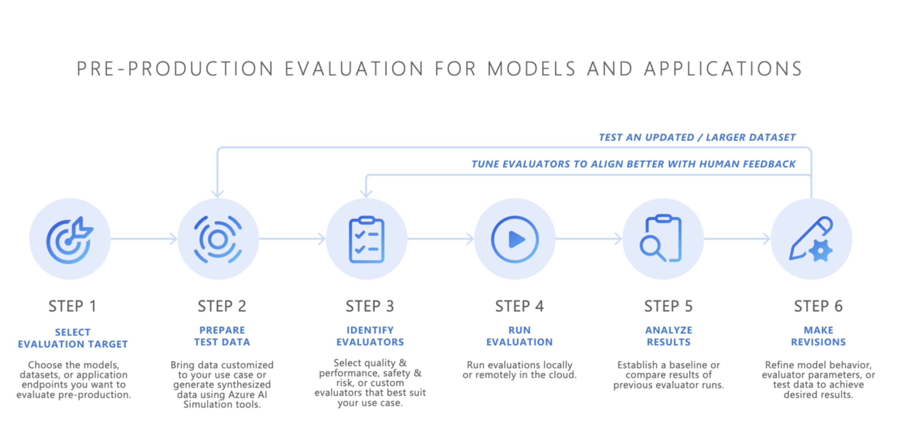
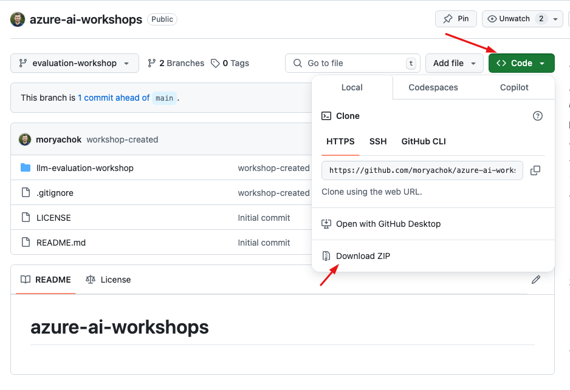

# Workshop: Evaluate your LLM application with Azure AI Foundry



## Introduction
In this workshop, you'll explore how to evaluate Large Language Models (LLMs) using [Azure AI Foundry](https://azure.microsoft.com/en-us/products/ai-foundry). By the end of this session, you'll be equipped with hands-on experience in setting up and evaluating your LLM model quality using different evaluation technics and tools.
To learn more about LLM evaluation visit evaluations [official documentation](https://learn.microsoft.com/en-us/azure/ai-studio/concepts/evaluation-approach-gen-ai).

The expected duration for the entire workshop is approximately **2 hours**.

> **Note:** to avoid unnecessary charges don't forget to cleanup resources created during this workshop.

## Key Learning Objectives
- Understand Azure AI Foundry’s evaluation capabilities.
- Learn how to evaluate model responses using manual and automated evaluation capabilities.
- Interpret evaluation results to choose the best model for the job.
- Learn how to create custom evaluators for your specific use case.

## Prerequisites
- Working [Azure AI Foundry Hub and Project](https://learn.microsoft.com/en-us/azure/ai-studio/how-to/create-azure-ai-resource?tabs=portal).
- Familiarity with LLMs and basic concepts in natural language processing (NLP).
- [Deploy gpt4o and gpt4o-mini](https://learn.microsoft.com/en-us/azure/ai-studio/how-to/deploy-models-openai) models in your Azure AI Foundry.
- (Optional) Azure ML with access to [Jupyter notebook](https://learn.microsoft.com/en-us/azure/machine-learning/how-to-run-jupyter-notebooks?view=azureml-api-2).

## Explore Assets

Download this git repository with all the assets. 
This will let you easily explore the internals and to use the sample evaluation datasets later on in the hands-on labs.

**1. Option #1 - download as zip archive and unzip.**



**2. Option #2 - use git utility**

```bash
# navigate to the directory of your choice on your local machine
git clone https://github.com/moryachok/azure-ai-workshops.git
```

In the context of this workshop we are using call transcript summarization use case.
For this workshop, we have prepared synthetic data containing call transcripts of three calls. These transcripts are stored in the `transcripts` folder. The data was generated using the GPT-4o model, and the prompt instructions used for generating these transcripts can be found in the `transcript-gen.prompty` file. If you'd like to generate additional transcripts, you can use the same prompt file.

`evaluations` folder contain multiple evaluation datasets. Each dataset was produced using a different LLM model to generate text summarizations of the transcripts, all following the same instructions. The evaluation files are formatted in the predefined structure required by the evaluation feature of the Azure AI Foundry:

```json
{
    "query": "the user prompt",
    "context": "the instructions to the model",
    "response": "the model's response"
}
```
---

> **Note:** Ensure participants have access to all necessary Azure resources and credentials before starting the workshop. Checkout [prerequisites](#prerequisites) section.

## Lab #1: (Optional) Create evaluation datasets
[Start the Lab](./lab1_create_evaluation_datasets.md)

## Lab #2: Use human manual evaluation to compare model responses

[Start the Lab](./lab2_manual_evaluation.md)

## Lab #3: Use automated evaluation with model-as-a-judge to find the best performing model for call transcript summarization.

[Start the Lab](./lab3_automated_evaluations.md)


## Lab #4: Create Custom Evaluator to ensure pii is reducted in your LLM responses.

[Start the Lab](./lab4_custom_evaluator.md)

## Cleanup

Delete resources created during the workshop to avoid unnecessary costs:
  - Delete evaluations
  - Delete Azure AI Foundry projects and hubs
  - Delete Storage Accounts
  - Delete Azure ML notebook
  - Delete Azure ML compute VM


## ⭐ Support This Project

If you found this workshop helpful or inspiring, please consider giving it a **star** ⭐ on GitHub. Your support helps increase visibility and lets others discover this project too!

## 🛠️ Feedback and Contributions

Have suggestions, found an issue, or want to request a feature? Feel free to:

- Open a Github issue to report a bug or request a feature.

Your feedback is highly valued and helps make this project even better!
