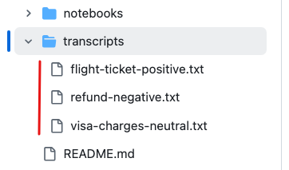

# Create evaluation datasets

In this lab you will learn how to prepare evaluation datasets. This lab is not mandatory as we already pre-created multiple evaluation datasets for this workshop.
You can skip this lab and go directly to [Lab2 - Use human manual evaluation to compare model responses](./lab2_manual_evaluation.md).

Evaluation datasets are crucial for later steps where you are going to use Large Language Model (LLM) to evaluate quality of responses of other models - this process called **model-as-a-judge** and it allows you to dramatically scale your evaluation process and run it in a fully automated way. 

For the sake of this lab we created sample scenario - **Call Center Transcripts Summarization**. You are going to evaluate how your LLM models are summarizing  transcripts of calls. This is common use case for LLM to handle.

You can find sample call transcripts in the [transcripts](./transcripts/) folder.



## Use python to generate evaluation datasets

Run the code below in your local environment or in a managed jupyter notebook using Azure ML.
Ensure you have completed all the [prerequisites](./README.md/#prerequisites).

Install pip packages.
```
pip install openai python-dotenv
```

The code assumes you have `.env` file with `AZURE_OPENAI_ENDPOINT` and `AZURE_OPENAI_API_KEY` [configured](https://pypi.org/project/python-dotenv/#getting-started).

```python
import os
from openai import AzureOpenAI
from dotenv import load_dotenv
import json

load_dotenv()

llm_deployment_name = "<replace with your deployment name>"

client = AzureOpenAI(
    azure_endpoint = os.getenv("AZURE_OPENAI_ENDPOINT"), 
    api_key=os.getenv("AZURE_OPENAI_API_KEY"), 
    api_version="2024-05-01-preview"
)

def get_transcript_text_from_file(file_path):
    try:
        with open(file_path, "r") as file:
            transcript = file.read()
            return transcript
    except FileNotFoundError:
        print(f"File not found: {file_path}")
    except Exception as e:
        print(f"An error occurred: {e}")


def append_to_file(file_path, text_to_append):
    try:
        with open(file_path, "a") as file:
            file.write(text_to_append + "\n")
        print(f"input appended successfully to: {file_path}")
    except Exception as e:
        print(f"An error occurred: {e}")

for file_path in ["assets/flight-ticket-positive.txt", "assets/refund-negative.txt", "assets/visa-charges-neutral.txt"]:
    transcript = get_transcript_text_from_file(file_path)
    instruction = "You are a helpful assistant summarizing call transcripts. Your output should contain customer name, agent name, issue, and resolution and next steps if exists."
    completion = client.chat.completions.create(
        model=llm_deployment_name, 
        max_tokens=800,
        temperature=0.7,
        messages=[
            {"role": "system", "content": instruction},
            {"role": "user", "content": transcript}
        ],  
    )

    evaluation_input = {
        "query": transcript,
        "context": instruction,
        "response": completion.choices[0].message.content  
    }

    print(json.dumps(evaluation_input))
    append_to_file(f"evaluations/summarization.{completion.model}.jsonl", json.dumps(evaluation_input))

print(f"evaluation dataset is created.")
```
The above code is using LLM deployed in your Azure AI Foundry to summarize the call transcripts.

This is the instructions you've provided to LLM:

> You are a helpful assistant summarizing call transcripts. Your output should contain customer name, agent name, issue, and resolution and next steps if exists.

The responses from the LLM are saved to a file in the structured  `jsonl` format.

**File Structure**:

- **query** - query includes the call transcript itself that is passed to LLM for summarization
- **context** - context includes the instructions passed to LLM.
- **response** - response is the LLM response itself. THis is what you are going to evaluate in the later labs in order to ensure that responses produced by LLM are high quality ones.

Open [summarization.gpt-3.5-turbo.jsonl](./evaluations/summarization.gpt-3.5-turbo-0125.jsonl) to review the example evaluation dataset.

To learn more about why do you need this format visit [Azure AI Foundry Evaluation documentation](https://learn.microsoft.com/en-us/azure/ai-studio/concepts/evaluation-metrics-built-in?tabs=warning#data-requirements-for-evaluators).

## Recap

In this section you've learned how you can create evaluation dataset. This workshop contain ready-to-use evaluation datasets in the [evaluations](./evaluations/) folder.
You will be reusing those datasets in the upcoming labs.

You can now proceed to [Lab2 - Use human manual evaluation to compare model responses](./lab2_manual_evaluation.md).