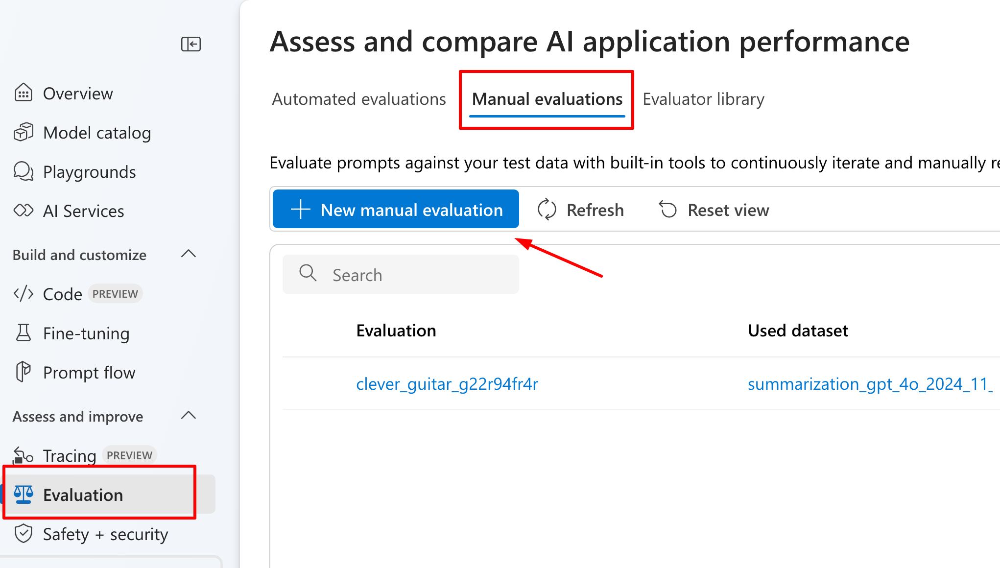
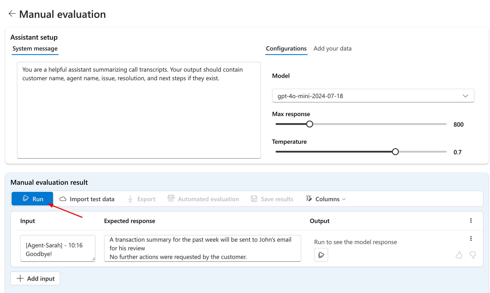
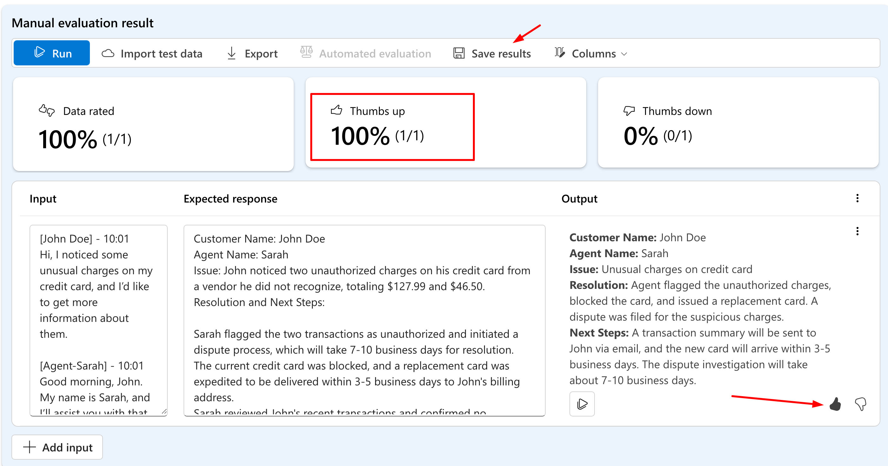

# Use manual evaluation by humans to compare models responses

Manual evaluation let your researchers to use their own judgement to evaluate the quality of the model. Azure AI Foundry let you easily provide prompt inputs and results and compare them in real-time with your deployed LLM model responses.

## Getting started with manual evaluation

1. Go to https://ai.azure.com
2. Click on **Evaluation** on the left navigation bar in Azure AI Foundry.
3. Choose the **Manual Evaluations** tab.
4. Click **New Manual Evaluation**.

5. Change the system message to the following:

> You are a helpful assistant summarizing call transcripts. Your output should contain customer name, agent name, issue, resolution, and next steps if they exist.

5. From the configuration, choose **gpt-4o-mini** as your model.
6. Keep the rest parameters with their default values.
7. In the **Manual Evaluation Result** section, add the contents from [`transcripts/visa-charges-neutral.txt`](./transcripts/visa-charges-neutral.txt) inside `input` field.

8. Paste text below into `Expected response` text area. Text below is generated by gpt-4o asked to provide a summarization for a given call transcript:

> Customer Name: John Doe  
Agent Name: Sarah  
Issue: John noticed two unauthorized charges on his credit card from a vendor he did not recognize, totaling $127.99 and $46.50.  
Resolution and Next Steps: 
> 1. Sarah flagged the two transactions as unauthorized and initiated a dispute process, which will take 7-10 business days for resolution.
> 2. The current credit card was blocked, and a replacement card was expedited to be delivered within 3-5 business days to John's billing address.  
> 3. Sarah reviewed John's recent transactions and confirmed no additional suspicious charges.  
> 4. A transaction summary for the past week will be sent to John's email for his review
>  
>No further actions were requested by the customer.

9. Click Run to generate LLM output and review the results.

You can now compare the `Expected Response` column, which in this workshop was generated by GPT-4o, with the `Output` column, containing responses generated by GPT-4o-mini for the same prompt. In many scenarios, such as text summarization, GPT-4o-mini provides results comparable to the GPT-4o model while offering greater cost efficiency and faster performance. Evaluating the results for your specific use case can help you choose the model that balances response quality with cost considerations.

## Rate the results

1.  Scroll down and give it thumb up or down.
2.  Click on Save results to get back to them later or share with collegues.

## Recap

Manual evaluation is a great way to easily compare multiple LLM responses and leverage your researchers’ judgment to provide feedback with thumbs up or down. You can import your test dataset or insert inputs and responses manually, as described in this section.

In the next section you will explore how to use automated evaluation mechanism for larger scale scenario.

Go to [Lab #3](./lab3_automated_evaluations.md).