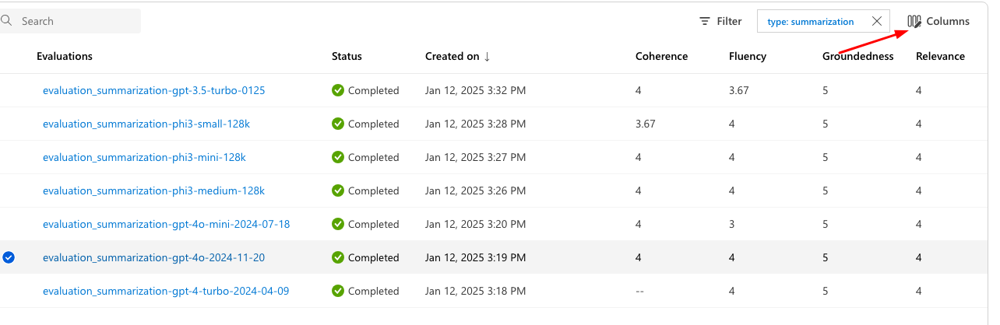

# Use automated evaluation with model-as-a-judge to find the best performing model for call transcript summarization.

In this section you will learn how to create and run an automated AI-assisted evaluation.
You will use `evaluations` datasets we providing as part of this workshop.
You will use [LLM model as a judge](https://learn.microsoft.com/en-us/azure/databricks/generative-ai/agent-evaluation/llm-judge-metrics) to evaluate the responses of the various models. To act as a judge you should pick the most prominent model, gpt-4o is a good candidate.

## 1. Create automated evaluation

1. Sign in to your Azure AI Foundry account at https://ai.azure.com.
2. On the left navigation bar, choose **Evaluation**.
3. Select the **Automated Evaluations** tab.
4. Click **New evaluation**.
5. Choose **Evaluate an existing output dataset**.

6. Give the evaluation a name: `summarization-gpt-3.5-turbo-0125`.
7. Tags are used to filter the results of the evaluation. Add the following tags:
   - **type** = `summarization`
   - **model** = `gpt-3.5-turbo-0125`
8. Click **Next**.

9.  Click on **Add Your Dataset**:
   - Upload the dataset: `evaluations/summarization.gpt-3.5-turbo-0125.jsonl`.
10. Validate that you see a preview of the top 3 rows from your dataset.

> **Note:** If you get the following warning: *Unable to preview the dataset. Ensure the dataset path is correct and leads directly to the data file (.csv or .jsonl).*
>
> **Resolution:** Try to Allow storage account key access on the Azure storage account associated with the Azure AI foundry.
11. Click **Next**.

12. Select AI quality metrics:
    - **Groundness**
    - **Relevance**
    - **Coherence**
    - **Fluency**
13. Select your Azure OpenAI connection and choose the **GPT4o** deployment model.

14. keep the rest setting with no change and click **Next**.
15. Review the settings and click **Submit**.

Repeat the above for the rest of evaluation datasets in the `evaluations` directory:
- summarization.gpt-4-turbo-2024-04-09.jsonl
- summarization.gpt-4o-2024-11-20.jsonl
- summarization.gpt-4o-mini-2024-07-18.jsonl
- summarization.phi3-medium-128k.jsonl
- summarization.phi3-mini-128k.jsonl
- summarization.phi3-small-128k.jsonl

You have launched 7 evaluation processes to review the quality of multiple models for calls transcripts summarization. By the end of the evaluation run you will get the rating per model to help you choose the best model for the job.

## 2. Explore Evaluation Results

In this section you will learn how to review the evaluation results in Azure AI Foundry. 

1. Open the **Evaluation** page.
2. Wait until all evaluations finish with `Status=Completed`.

3. Use filters to keep only relevant evaluations:
   - Click on **Filter**.
   - Click **Add Filter** and search for **Tags**.
   - Select the `type` tag and choose the **Equal To** operator.
   - Fill `summarization` as the value.
   - Click **Apply**.

4. Click on **Columns** and reorder columns to easily view the relevant metrics:
   - **Evaluations**, **Status**, **Created on**, **Coherence**, **Fluency**, **Groundness**, **Relevance**.

### Review the Results:

Now you can  Compare evaluation results to find the best-performing model.

1. Select two models and click on **Compare**.
2. Azure AI Foundry will display the delta between metrics, allowing you to perform a metric-by-metric comparison to drill down into the results of the two evaluation processes.
3. Each decision is supported by a **Reason**: the Model-as-a-Judge feature provides comments explaining why certain ratings were applied to a metric.

## Recap

Evaluation helps you identify the best-performing models for a specific task. While benchmarks provide general performance information about a model, evaluations give you deeper insights into which model will best serve your organizational use case.

The evaluation process can and should be iterative. It can help you maintain the quality of your llm responses when you make system prompt changes, evaluation llm parameter changes such as temperature or to check how newer model versions will perform before using them in production.

Now that you are familiar with automated evaluations we encourage you to create your first custom evaluator.

Go to [Lab #4](./lab4_custom_evaluator.md).