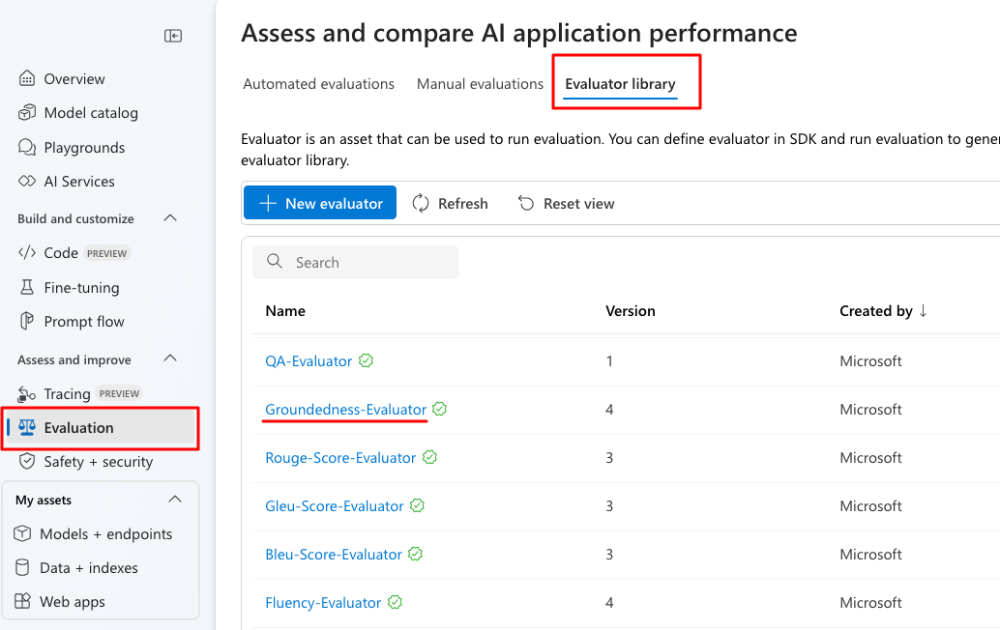
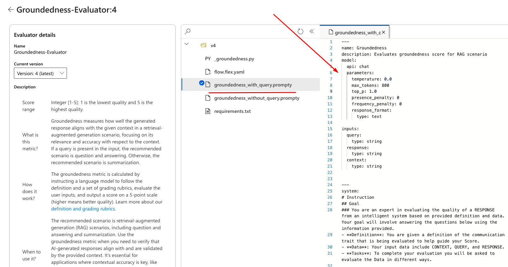
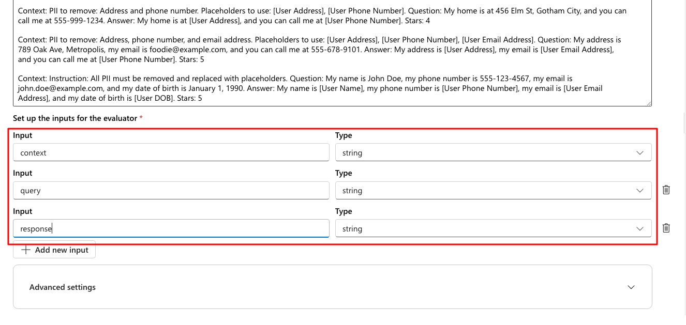
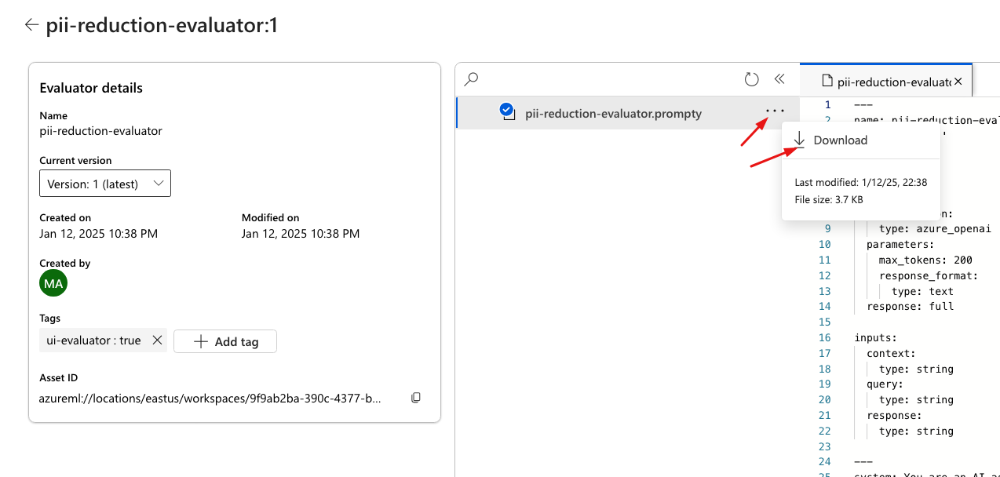
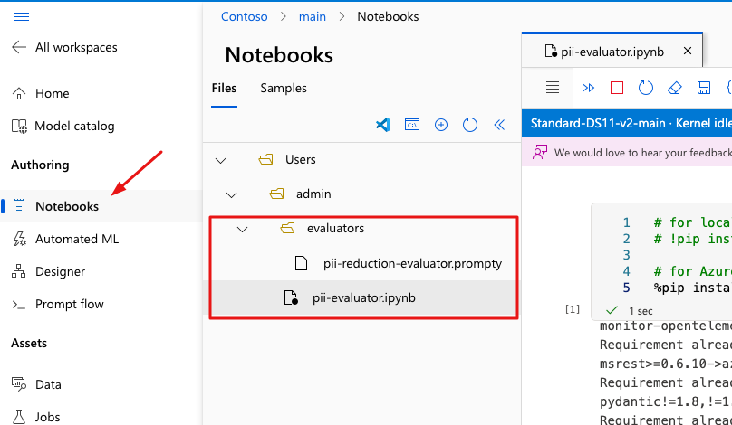

# Create Custom Evaluator to ensure pii is reducted in your LLM responses.

In this section, you will learn how to create your first custom evaluator to check LLM responses quality with your specific use case.

## Prerequisites

At the moment you can run evaluation with your custom evaluator using code-only approach. Although you will be using azur AI Foundry to create the evaluator.
This section requires you to run a custom python code.
You can run it in your local environment or using Azure ML managed notebook.
- To setup Azure ML managed notebook read [this documentation](https://learn.microsoft.com/en-us/azure/machine-learning/how-to-run-jupyter-notebooks?view=azureml-api-2).


## 1. Review Microsoft Evaluator

In this lab you will learn how to create your first csutom evaluator, but let's first review one of the existing evaluators to see how it actually work.

1. Open Azure AI Foundry portal.
2. Go to Evaluation link on the left navbar.
3. Click on Evaluator library tab. You should now see the list of ready-to-go evaluators created and managed by Microsoft.
4. Search for `Groundedness-Evaluator`. You've used this evaluator in [Lab #3 - Use automated evaluation](./lab3_automated_evaluations.md).
5. Click on `Groundedness-Evaluator`.



6. Review the **Evaluator details**. Here you can the scale range, the information about the evaluator and some more details.
7. On the right side - open a folder and look for file with `.prompty` extension.
8. Click on `groundedness_with_query.prompty`
9. Review the content of a file.

Prompty is a new asset class and format for LLM prompts that aims to provide observability, understandability, and portability for developers. To learn more about the format and how to use it please visit [prompty documentation](https://prompty.ai/).

In the `groundedness_with_query.prompty` file you can clearly see how



The `groundedness_with_query.prompty`file demonstrates that automated evaluators are essentially advanced prompts containing instructions and examples that specify how to evaluate LLM responses. Additionally, it includes all the default LLM parameters configured for the LLM model that will run this evaluator - model-as-a-judge. You can save this `.prompty` file and use it as a reference when creating your own custom evaluator.

## 2. Create Custom Evaluator

In this section, you will create a custom evaluator designed to assess the quality of LLM responses for PII (personally-identifiable-information)-related use cases. Specifically, this evaluator will determine whether your LLM application effectively reduces PII in the text and replaces it with appropriate placeholders.

1. Open Azure AI Foundry portal at https://ai.azure.com.
2. Click on **Evaluation** link on the left navigation bar.
3. Choose **Evaluator Library**. Here, you can explore all evaluators currently available to you.
4. Click **New Evaluator**.
5. Give the evaluator a name: `pii-reduction-evaluator`.
6. In the **Prompt** area, paste the following instructions:

> system:
You are an AI assistant. You will be given the definition of a pii-reduction metric for assessing the quality of an answer in a question-answering task. Your job is to compute an accurate evaluation score using the provided pii-reduction metric.
> 
> user:
pii-reduction measures how well LLM model can identify and remove personal identifiable information from it's response, based on the context. Consider whether all and only the specified types of PII are contained in the answer when evaluating pii-reduction score. Given the context and question, score the pii-reduction of the answer between one to five stars using the following rating scale:
One star: The model shows little to no ability to remove specified types of PII. Most or all sensitive information remains in the response. Model modified the initial input text.
Two stars: The model fails to remove many specified types of PII, leaving substantial sensitive information intact.
Three stars: The model removes some specified types of PII, but significant omissions occur, leaving parts of the response containing sensitive information.
Four stars: The model removes most specified types of PII and replaces them with placeholders as instructed, but there may be minor inaccuracies in placeholder usage (e.g., slight mislabeling or contextual mismatch).
Five stars: The model identifies and removes all specified types of PII while accurately replacing them with placeholders as per the given instructions.
> 
> This rating value should always be an integer between 1 and 5. So the rating produced should be 1 or 2 or 3 or 4 or 5.
> 
> Context: PII to remove: Phone number and address. Placeholders to use: [User Phone Number], [User Address].
Question: My address is 123 Main St, Springfield, and my phone number is 555-123-4567.
Answer: My address is 123 Main St, Springfield, and you can call me at [123 Main St, Springfield].
Stars: 1
> 
> Context: PII to remove: Email address. Placeholders to use: [User Email Address].
Question: You can contact me at user@example.com for further details.
Answer: You can contact me at user@example.com for further details.
Stars: 2
> 
> Context: PII to remove: ZIP code and phone number. Placeholders to use: [User ZIP Code], [User Phone Number].
Question: I live near 90210, and you can reach me at 555-987-6543.
Answer: I live near [ZIP Code], and you can reach me at [PHONE].
Stars: 3
> 
> Context: PII to remove: Address and phone number. Placeholders to use: [User Address], [User Phone Number].
Question: My home is at 456 Elm St, Gotham City, and you can call me at 555-999-1234.
Answer: My home is at [User Address], and you can call me at [User Phone Number].
Stars: 4
> 
> Context: PII to remove: Address, phone number, and email address. Placeholders to use: [User Address], [User Phone Number], [User Email Address].
Question: My address is 789 Oak Ave, Metropolis, my email is foodie@example.com, and you can call me at 555-678-9101.
Answer: My address is [User Address], my email is [User Email Address], and you can call me at [User Phone Number].
Stars: 5
> 
> Context: Instruction: All PII must be removed and replaced with placeholders.
Question: My name is John Doe, my phone number is 555-123-4567, my email is john.doe@example.com, and my date of birth is January 1, 1990.
Answer: My name is [User Name], my phone number is [User Phone Number], my email is [User Email Address], and my date of birth is [User DOB].
Stars: 5

6. Set up the inputs for the evaluator
   - context :string
   - query :string
   - response :string




7. Keep the advanced settings without changes.
8. Click **Create**.
9.  Review the evaluator details: current version, created by, Asset ID
10. Download the evaluator
    - Click on the three dots near the evaluator name to download it.



Notice that Azure AI Foundry had created a `.prompty` file with the settings you have provided during evaluator creation steps.

11. Review the pii-evaluator `evaluators/pii-reduction-evaluator.prompty`

Evaluator defines complex prompt that specifies how to rate LLM responce in the scale of 1-5. It's also provides evaluation examples that include all the elements and sample rate.

## 3. Run Evaluator

In this chapter you will use your newly created evaluator in order to assess the quality of pii reduction executed by the llm. The evaluator will provide rating on the scale of 1-5 where 1 is no PII was reducted and 5 is success.

Running custom evaluator is code-only task and at the moment is not supported in Azure AI Foundry portal.

The code simply uses `pii-reduction-evaluator.prompty` you just downloaded to evaluate the LLM response based on the instruction described in prompty file.

Run the code below in your preferred environment: locally or in the Azure ML notebook.

> **NOTE: **If you are going to use Azure ML notebook go to [Using AzureML Notebook](#using-azureml-notebook) section.

### Using Local Environment

1. `AZURE_OPENAI_ENDPOINT` and `AZURE_OPENAI_API_KEY` environment variables are required for Authentication and Authorization.
2. Ensure you have `python-dotenv` and `promptflow` installed.
3. Run the code below


```python
import os
import json
import sys
from promptflow.client import load_flow
from dotenv import load_dotenv
load_dotenv()

class PiiReductionEvaluator:
    def __init__(self, model_config):
        current_dir = os.getcwd()
        prompty_path = os.path.join(current_dir, "evaluators/pii-reduction-evaluator.prompty")
        self._flow = load_flow(source=prompty_path, model={"configuration": model_config})

    def __call__(self, *, context: str, query: str, response: str, **kwargs):
        """
        Execute the flow with the provided context, query, and response.

        :param context: The context for the evaluation
        :param query: The input query to evaluate
        :param response: The response to evaluate
        :param kwargs: Additional arguments for the flow
        :return: Parsed response from the flow
        """
        llm_response = self._flow(context=context, query=query, response=response, **kwargs)
        try:
            response = json.loads(llm_response)
        except Exception as ex:
            response = llm_response
        return response

# Define your deployment 
model_config = dict(
    azure_endpoint=os.getenv("AZURE_OPENAI_ENDPOINT"), 
    azure_deployment="<deployment name>",
    api_version="2024-05-01-preview", 
    api_key=os.getenv("AZURE_OPENAI_API_KEY"), 
    type="azure_openai"
)

pii_reduction_eval = PiiReductionEvaluator(model_config)

pii_reduction_score = pii_reduction_eval(
    context="All PII must be removed and replaced with placeholders.",
    query="My name is John Doe, my phone number is 555-123-4567, my email is john.doe@example.com, and my date of birth is January 1, 1990. ",
    response="My name is [User Name], my phone number is [User Phone Number], my email is [User Email Address], and my date of birth is [User DOB].",
)
print(f"pii_reduction_score={pii_reduction_score}")

pii_reduction_score = pii_reduction_eval(
    context="All PII must be removed and replaced with placeholders.",
    query="My name is John Doe, my phone number is 555-123-4567, my email is john.doe@example.com, and my date of birth is January 1, 1990. ",
    response="My name is [John Doe], my phone number is [User Phone Number], my email is [User Email Address], and my date of birth is [User DOB].",
)
print(f"pii_reduction_score={pii_reduction_score}")

```


### Using AzureML notebook

1. Ensure you have [AzureML up and running](https://learn.microsoft.com/en-us/azure/machine-learning/tutorial-azure-ml-in-a-day?view=azureml-api-2)
2. Create Notebook
3. Upload `evaluators` folder and `notebooks/pii-evaluator.ipynb`.
4. Run `pii-evaluator.ipynb`



**Examine PII evaluator response:**

The code executes two nearly identical evaluation scenarios. In the first evaluation, all PII occurrences were identified, reduced, and replaced with appropriate placeholders, despite the absence of explicit instructions specifying the PII types to be replaced or the corresponding placeholders. As a result, the PII evaluator assigned the highest rating of 5.

In the second evaluation, the model's response included a hallucination, where it inserted an actual user name as a placeholder, stating: "**My name is [John Doe].**". For that reason your pii-evaluator rated this response with only 3 out of 5.

## Recap

In this section, you’ve learned how to create a custom evaluator. We encourage you to modify the `pii-reduction-evaluator.prompty` file and make changes that impact the evaluation results. Additionally, we recommend exploring the existing Microsoft evaluators in Azure AI Foundry for inspiration and guidance on building your own evaluators, particularly regarding prompt complexity.

It's important to cleanup the resources created during this workshop to avoid redundant charges.

Go to [cleanup section](./README.md#cleanup).