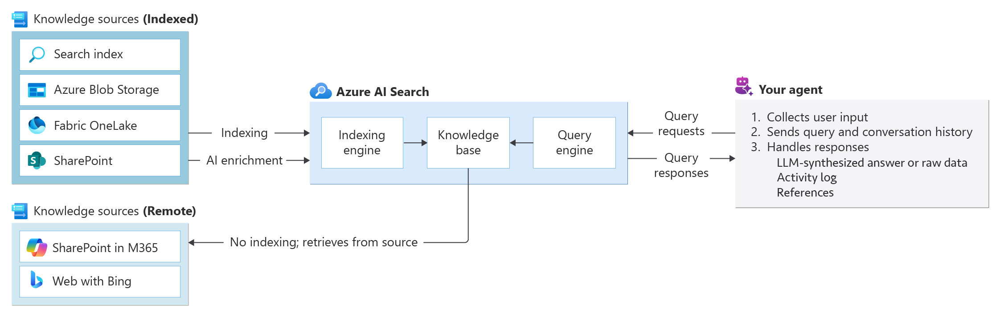
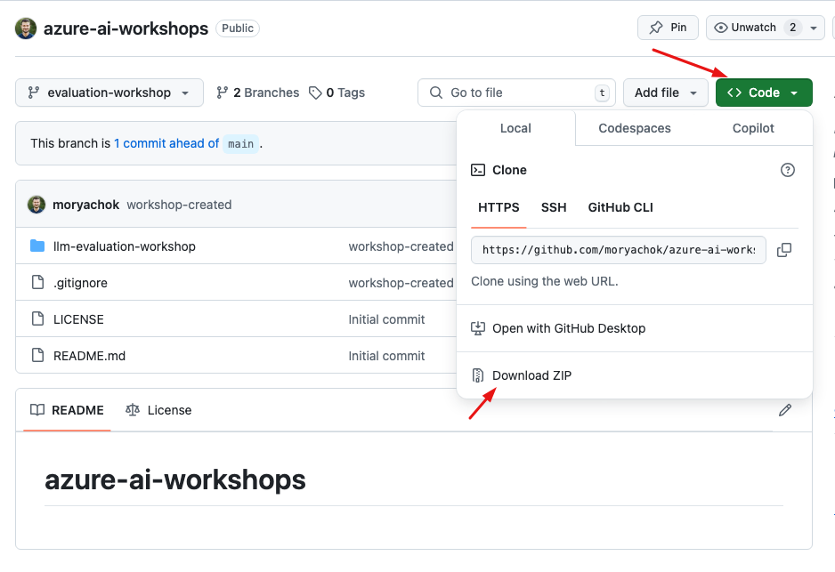

# Workshop: Advanced RAG with Azure AI Search and Microsoft Foundry




## Introduction

Welcome to the Advanced RAG Workshop where you will learn how to build a support Agent. Through guided labs, you’ll learn how to build end-to-end ingestion and retrieval pipelines with Azure AI Search and Microsoft Foundry. You will ingest multiple data formats such as DOCX and CSV, explore search and retrieval techniques including vector search, filters, and semantic ranking, and finally connect Azure AI Search to a Foundry Agent Service to power question answering with real data. By the end of the session, you’ll have practical experience setting up the required Azure resources, understanding core search assets, and integrating search into an AI application, along with sample code to extend the solution further.

**Expected duration**: approximately 2 hours.

> **Note:** to avoid unnecessary charges don't forget to cleanup resources created during this workshop.

## Key Learning Objectives

- Understand the core concepts and architecture of Azure AI Search and how it integrates with Microsoft Foundry.

- Learn how to build ingestion pipelines for unstructured and structured data using indexes, data sources, indexers, and skills.

- Explore search and retrieval techniques including keyword, vector, filtered, and semantic search.

- Learn how to connect Azure AI Search to a Foundry agent and use it to answer questions over your indexed data.

## Prerequisites

- Create [Microsoft Foundry](https://learn.microsoft.com/en-us/azure/ai-foundry/quickstarts/get-started-code) and deploy `text-embedding-3-small` embedding model.
- Create [Azure AI Search cluster](https://learn.microsoft.com/en-us/azure/search/search-create-service-portal).
- Create [Azure Storage Account](https://learn.microsoft.com/en-us/azure/storage/common/storage-account-create?tabs=azure-portal). 
- Create [storage account container](https://learn.microsoft.com/en-us/azure/storage/blobs/storage-quickstart-blobs-portal) with name `rag-workshop`.

## Explore Assets

Download this git repository with all the assets. 
This will let you easily explore the internals and to use the sample evaluation datasets later on in the hands-on labs.

**1. Option #1 - download as zip archive and unzip.**



**2. Option #2 - use git utility**

```bash
# navigate to the directory of your choice on your local machine
git clone https://github.com/moryachok/azure-ai-workshops.git
```

### Sample data

Data is a crucial part of any AI system: the more accurate and well-structured your data is, the higher the quality of the AI results you can expect. The format of the data directly affects the design of your ingestion pipelines and the enrichment steps required to make the data searchable and useful. In this workshop, sample datasets are provided in both CSV and DOCX formats to simulate real-world scenarios where data is sourced from multiple systems in different representations. The data focuses on technical support use cases and is sourced from two public Kaggle repositories, with all files available in the [datasets](datasets/) folder for exploration before and during the labs.

**Kaggle references**:
- https://www.kaggle.com/datasets/bhallaakshit/customer-support-data
- https://www.kaggle.com/datasets/suraj520/customer-support-ticket-dataset


> **Note:** Ensure participants have access to all necessary Azure resources and credentials before starting the workshop. Checkout [prerequisites](#prerequisites) section.

## Lab #1: Ingest textual data into Azure AI Search
[Start the Lab](./lab1_text_ingestion.md)

## Lab #2: Ingest CSV data into Azure AI Search

[Start the Lab](./lab2_csv_ingestion.md)

## Lab #3: Advanced data retrieval

[Start the Lab](./lab3_retrieval.md)

## Lab #4: Create AI Agent with Microsoft Foundry

[Start the Lab](./lab4_foundry.md)

## Cleanup

Delete resources created during the workshop to avoid unnecessary costs:
  - Delete Microsoft Foundry
  - Delete Azure Storage Account
  - Delete Azure AI Search

## ⭐ Support This Project

If you found this workshop helpful or inspiring, please consider giving it a **star** ⭐ on GitHub. Your support helps increase visibility and lets others discover this project too!

## 🛠️ Feedback and Contributions

Have suggestions, found an issue, or want to request a feature? Feel free to:

- Open a Github issue to report a bug or request a feature.

Your feedback is highly valued and helps make this project even better!