# Ingest and vectorize text files into Azure AI Search using Indexer and Skillsets

Data ingestion is crucial part of building RAG system. Azure AI Search has multiple features to help you to transform, enrich and ingest data into AI Search indexes.

In this lab you're going to learn about Azure AI Search ingestion pipeline features such as Indexer, Skillset and Data Sources.

Its important to mention that you can also use Azure Search python SDK or Rest API to ingest data directly from your sources or build custom connectors. [Learn more about ingesting data using SDK or Rest API.](https://learn.microsoft.com/en-us/azure/search/search-what-is-data-import)

## About Indexer, Skillset and Data Source

Ingestion pipeline is comprised of three main components.

**Data Source** - Azure AI Search integration object allows you to connect to one of the supported sources such as Azure Storage Account, Microsoft Fabric OneLake and more.

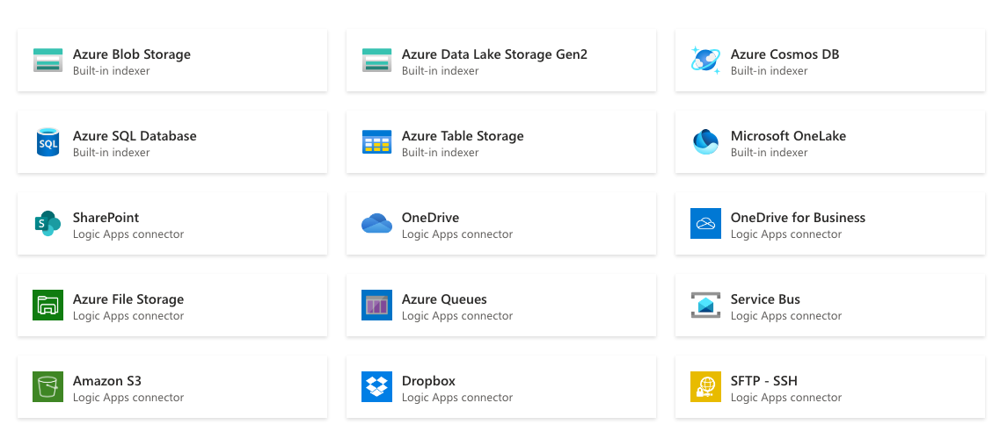

**Indexer** - pull-based mechanism optimized for batch ingestion that extracts data from supported sources, applies optional AI enrichment such as OCR, chunking, and embeddings, and loads the results into a search index via field mappings. Indexers can run on demand or on a schedule.

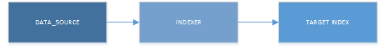

Indexers support multiple file formats such as `JSON`, `CSV`, `PDF`, `DOCX`, and others, enabling unified ingestion across diverse content types. When an Azure Storage Account is used as the data source, indexers can ingest blob metadata alongside file content, enriching the searchable information available in the index; for details, see [the official documentation.](https://learn.microsoft.com/en-us/azure/search/search-blob-metadata-properties)


**Skillset** - let you enrich your data in-transit and ingest it into the target index. Indexer can be paired with skillets to create embeddings, detect PII, translate the data or simply chunk the data. You can chain multiple steps in the skillset to apply AI transformations one after another. The most common skills are:

- [Text Split](https://learn.microsoft.com/en-us/azure/search/cognitive-search-skill-textsplit) - used to apply chunking when working with large textual documents.
- [Azure OpenAI Embedding](https://learn.microsoft.com/en-us/azure/search/cognitive-search-skill-azure-openai-embedding) - used to create vector embeddings out of textual data. This uses embedding models supported in Microsoft Foundry such as `text-embedding-3-small` and `text-embedding-3-large`.
- [Layout](https://learn.microsoft.com/en-us/azure/search/cognitive-search-skill-document-intelligence-layout) - uses Azure Document Intelligence Layout Detection AI model to detect document structure. Commonly let you apply smarter chunking strategy to capture content under same section even across multiple pages.

[Learn more](https://learn.microsoft.com/en-us/azure/search/cognitive-search-predefined-skills) about other supported skills.

## Upload your files into Azure Storage

In this lab you are going to use your previously created Azure Storage Account as your integration point.

> Ensure you have followed the Prerequisites section and created Azure Storage Account. If not please do it now.

1. In the Azure Portal, go to your Storage account -> Data Storage -> Containers. Click on **rag-workshop** container that you've previously created.

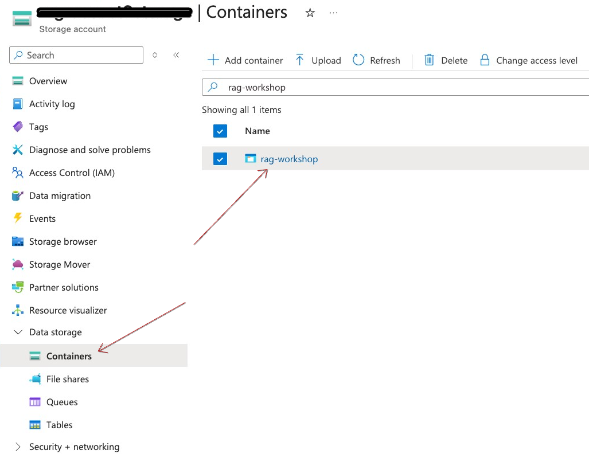 

2. Click **Add Directory**, call it `docx`, click **Ok**.

3. Click Upload, then in the file select `FAQs.docx` and `how-to-guides.docx` files from the `datasets/docx` folder. Keep the destination path as `docx/` so the files are organized under that prefix, and click **Upload**.

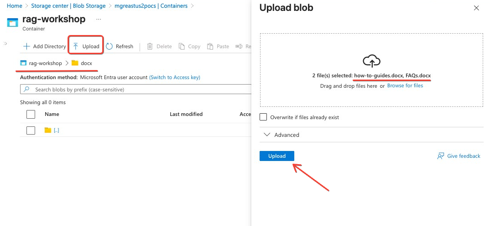

3. Once the upload completes, verify that the files appear in the container under the `docx/` path and that each document is listed as a blob, confirming they are ready to be used as a data source for downstream indexing.

Your Storage Account now should look like this
```
{storage account name}/
└── rag-workshop/
    └── docx/
        ├── FAQs.docx
        └── how-to-guides.docx
```
## Create Index

Now that you've prepared your data for ingestion you will be focusing on creating the required setup on the AI Search side.

You will start with creating index. Index is similar to a database table. It stores data in a non-relational schema and enables full-text, vector, hybrid, and filtered queries with millisecond-level performance. To learn more about indexes [visit this page](https://learn.microsoft.com/en-us/azure/search/search-what-is-an-index).

Index schema is semi-structured and can have nested fields. You must create the index before ingestion and design it with your expected query patterns in mind, ensuring all required fields for search, filtering, and retrieval are defined upfront. Once an index is created, existing fields cannot be modified or deleted. Only new fields can be added.

1. In the Azure portal, open Azure AI Search service. In the left menu, go to Search management → Indexes and select + Add index (or Create index). 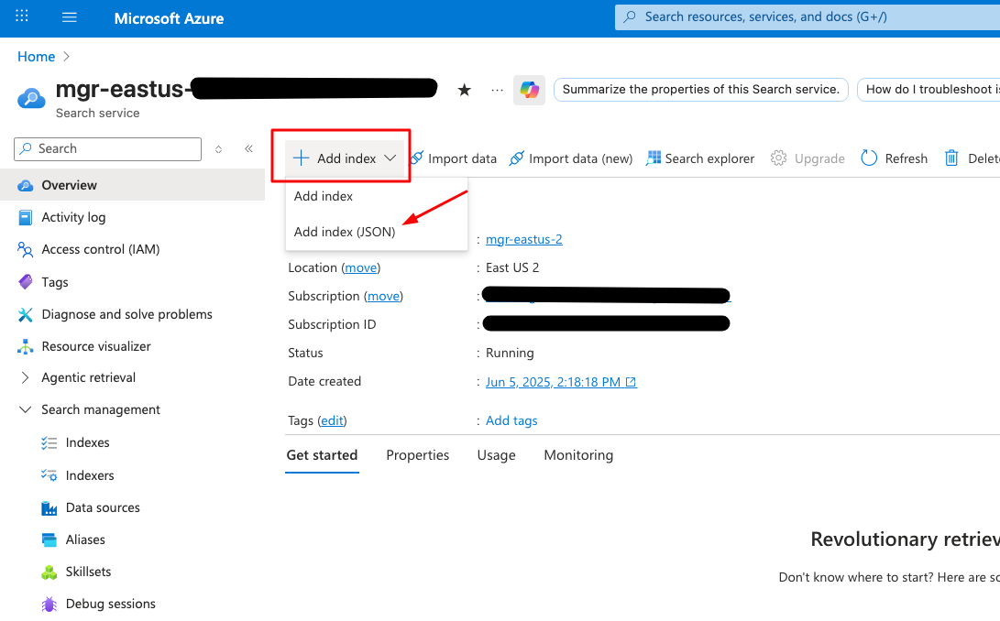 

2. Copy the full contents of `src/lab1/index.json` from the repository, then paste it into the editor. Review the index name and schema to ensure they match your expected query patterns and required fields. !
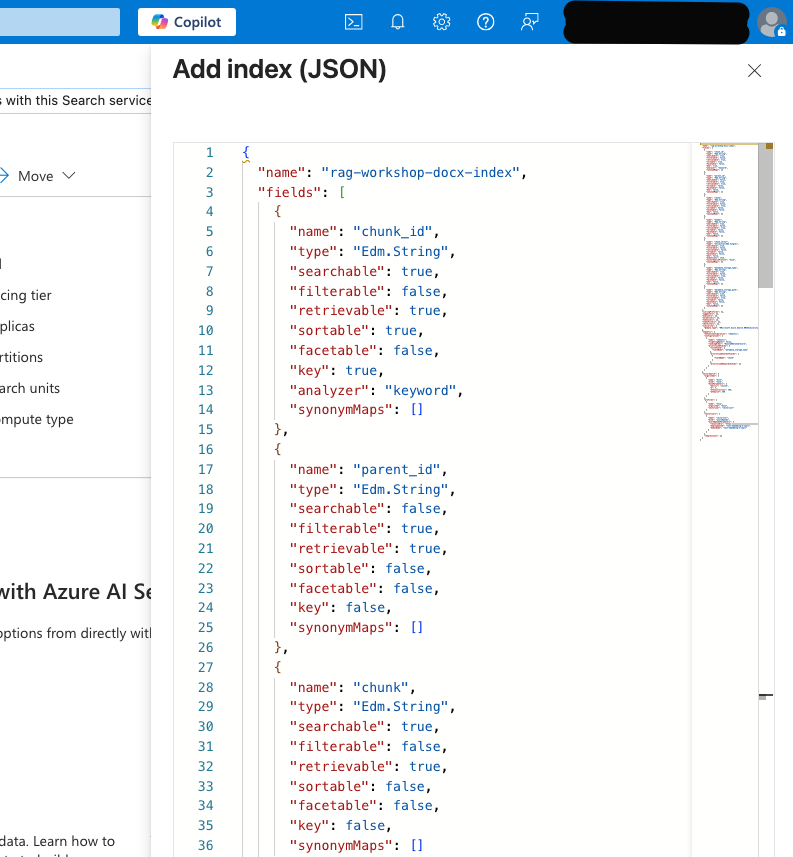 

3. Scroll down to the bottom of index configuration till you see `vectorizers` section. Change the `resourceUri` field to correspond previously create Microsoft Foundry endpoint. 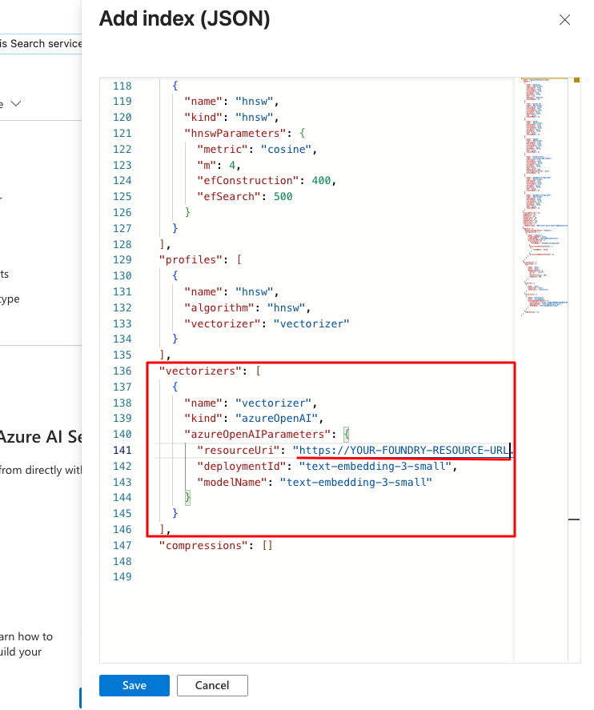

4. Click **Save**

5. In the left navigation bar go to Search Management -> Indexes. Ensure `rag-workshop-docx-index` has been created. 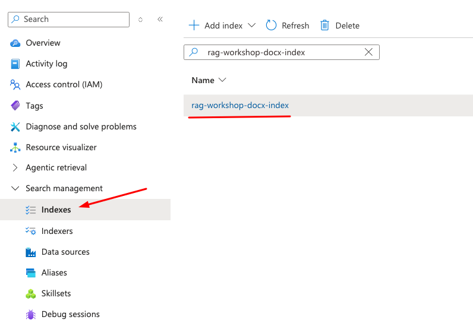

6. Click on the index name then click on `Fields` to explore index schema. Explore each field and it's corresponding atributes such as Retrievable, Filterable, Sortable, Searchble. You can learn more about them [here](https://learn.microsoft.com/en-us/azure/search/search-what-is-an-index#field-attributes). 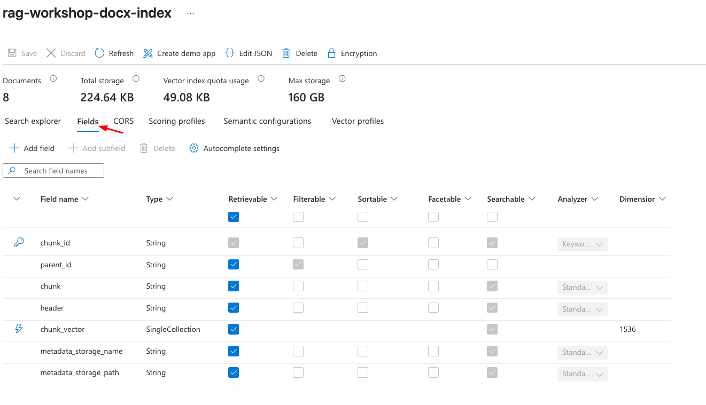

7. Note `chunk_vector` field of type `SingleCollection` with `Dimension` configuration of `1536`. This field will be populated with embedding vectors generated with `text-embedding-3-small` model. 

Congrats 👏 you now have your first index and you're ready to start ingesting data into it. Now proceed to creating an ingestion pipeline components.

## Create Data Source

1. Go to Search Management -> Data sources. Click on Add Data Source. 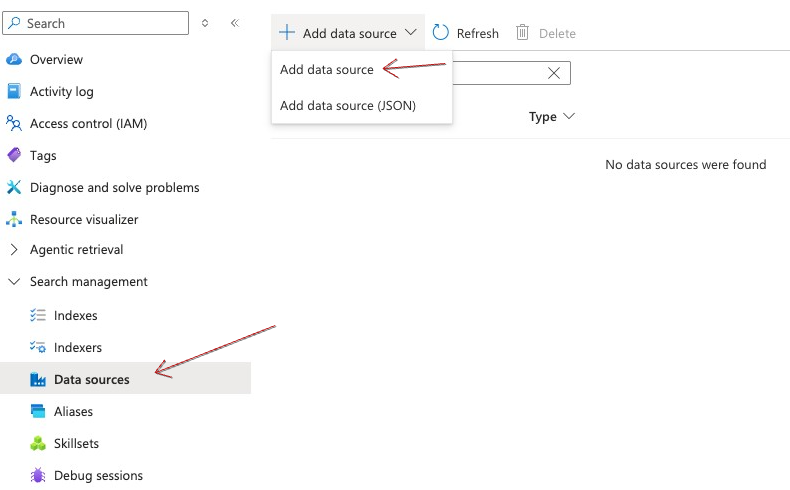 
2. Give your data source a name `rag-workshop-docx-datasource`, then select your Storage Account, Blob Container and `docx` as a folder. Keep defaults for other fields and click `Create`. 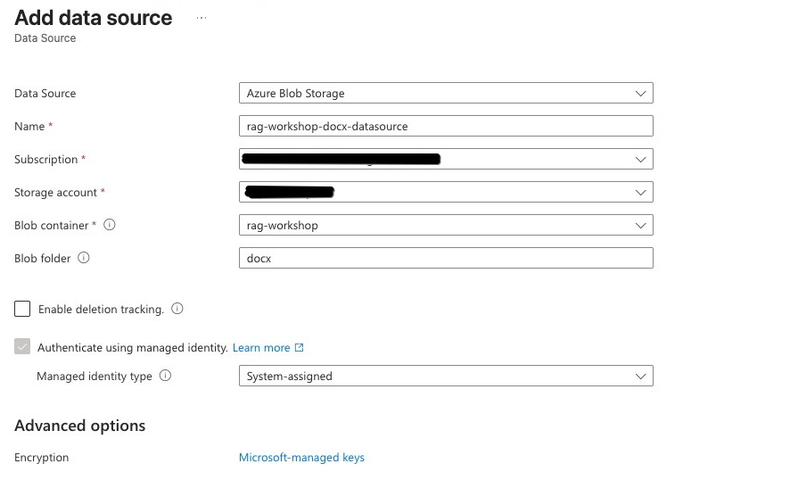 

## Create Skillset

Skillset can be comprised of one or more steps each responsible for specific data manipulation or AI enrichment. 

Open `src/lab2/skillset.json` and review what it does.

### Review Document Intelligence Layout Skill configuration

It uses Document Intelligence Layout Skill to extract structured content from documents (DOCX in our case) and converts them to `Markdown` format.

```json
{
    "@odata.type": "#Microsoft.Skills.Util.DocumentIntelligenceLayoutSkill",
    "name": "#1",
    "context": "/document",
    "outputMode": "oneToMany",
    "markdownHeaderDepth": "h3",
    "outputFormat": "markdown",
    "extractionOptions": [],
    "inputs": [
        {
            "name": "file_data",
            "source": "/document/file_data",
            "inputs": []
        }
    ],
    "outputs": [
        {
            "name": "markdown_document",
            "targetName": "markdownDocument"
        }
    ]
}
```

**What it does:**

- Takes raw file data as input (`/document/file_data`).
- Uses Azure's Document Intelligence service to analyze the document layout.
- Outputs `Markdown` with headers up to h3 depth.
- Uses `oneToMany` mode, meaning it can generate multiple output documents from a single input (useful for multi-page documents or sections).
- Stores the result in `markdownDocument` field.
- This step is crucial for **semantic chunking** that allow you to split documents based on the header sections and not based on hard-coded amount of characters.

### Review Azure OpenAI Embedding Skill configuration

Azure OpenAI Embedding Skill that generates vector embeddings for semantic search. AI Search supports both legacy Azure OpenAI Service and Microsoft Fabric.

```json
{
    "@odata.type": "#Microsoft.Skills.Text.AzureOpenAIEmbeddingSkill",
    "name": "#2",
    "context": "/document/markdownDocument/*",
    "resourceUri": "https://<YOUR FOUNDRY RESOURCE URL>.openai.azure.com",
    "apiKey": "INSERT YOUR MICROSOFT FOUNDRY API KEY",
    "deploymentId": "text-embedding-3-small",
    "dimensions": 1536,
    "modelName": "text-embedding-3-small",
    "inputs": [
        {
            "name": "text",
            "source": "/document/markdownDocument/*/content",
            "inputs": []
        }
    ],
    "outputs": [
        {
            "name": "embedding",
            "targetName": "embedding"
        }
    ]
}
```

**What it does:**

- Takes each Markdown document chunk from *skill #1* (`/document/markdownDocument/*/content`).
- Sends the text to embedding model `text-embedding-3-small` deployed in Microsoft Fabric.
- Generates 1536-dimensional vector embeddings for each textual chunk.
- Stores vectors in the `embedding` field.
- You will see how this embedding field will be mapped to `chunk_vector` field in `indexProjections` part of the skillset.

### Review Index Projections configuration

Index Projections configuration defines how processed data gets stored in the target search index. Index projections can be sometimes skipped, but in this case it is required because the `oneToMany` output mode used in `DocumentIntelligenceLayoutSkill` skill.

```json
{
    "indexProjections": {
        "selectors": [{
            "targetIndexName": "rag-workshop-docx-index",
            "parentKeyFieldName": "parent_id",
            "sourceContext": "/document/markdownDocument/*",
            "mappings": [
                {
                    "name": "chunk",
                    "source": "/document/markdownDocument/*/content",
                    "inputs": []
                },
                {
                    "name": "chunk_vector",
                    "source": "/document/markdownDocument/*/embedding",
                    "inputs": []
                },
                {
                    "name": "header",
                    "source": "/document/markdownDocument/*/sections/h1",
                    "inputs": []
                },
                {
                    "name": "metadata_storage_path",
                    "source": "/document/metadata_storage_path",
                    "inputs": []
                },
                {
                    "name": "metadata_storage_name",
                    "source": "/document/metadata_storage_name",
                    "inputs": []
                }
            ]
        
       }]
    }
}
```

**Mapped fields:**

- `parent_id` - Links chunks to their parent document.
- `chunk` - the actual text content of each chunk.
- `chunk_vector` - the 1536-dimensional embedding from skill #2.
- `header` - the h1 heading associated with the chunk (for context).
- `metadata_storage_path` - original file location in Azure Storage Account. This helps you track where your chunks originate from.
- `metadata_storage_name` - original filename in Azure Storage Account.
- `projectionMode=skipIndexingParentDocuments` is default, meaning we are not interested in ingesting the origin file entirely.


### Creating Skillset

1. Go to Search Management -> Skillsets. Click `add skillset`.
2. Copy the full contents of `src/lab1/skillset.json` from the repository, then paste it into the editor.
3. Change `resourceUri` field with your Foundry endpoint.
4. Change `apiKey` field with your Foundry api key.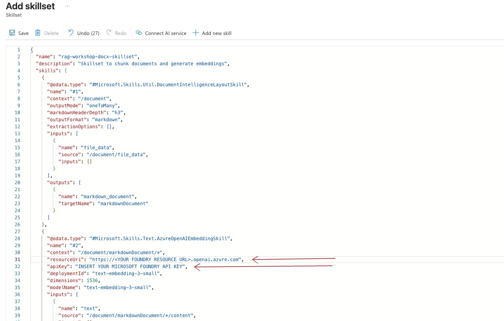  
5. Click **Save**.


## Create Indexer

Go to Search Management -> Indexers. Click `add indexer`.

**Basic Settings:**

- Name = `rag-workshop-docx-indexer`.
- Index = `rag-workshop-docx-index`.
- Datasource = `rag-workshop-docx-datasource`.
- Skillset = `rag-workshop-docx-skillset`.
- Schedule = `Once`.

**Advanced Settings:**

- Data to extract = `Content and Metadata`.
- Parsing mode = `Text`.
- Allow Skillset to read file data = `Checked`.
- Skip other fields, scroll up and click **Save**.

## Run ingestion

Excellent, now you are ready to ingest your data into an index! 
The ingestion pipeline is controlled by an indexer that is connected to data source and skillset on one side and target index on another. 
Indexer keeps track of the loaded files - you can use it to incrementally load data into index. Just add more files into a Azure Storage Account folder and after next indexer run the new files will be ingested into the index. 
You can schedule index to run periodically or run it manually from the UI.

Go to Search Management -> Indexers. Click on your `rag-workshop-docx-indexer`.

Click `Run` button and wait few seconds.
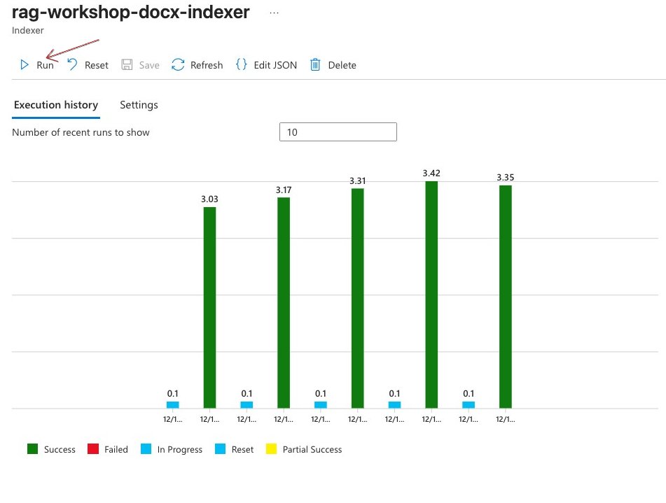 

Click on `Refresh` and see if the run was successful.

Check `Docs succeeded` section on the right part of a page. It should be 2.

## Explore the data

Now explore the index data.

Go to Search Management -> Indexes. Click on `rag-workshop-docx-index`.

Click on `Search` button to run a query against the index.

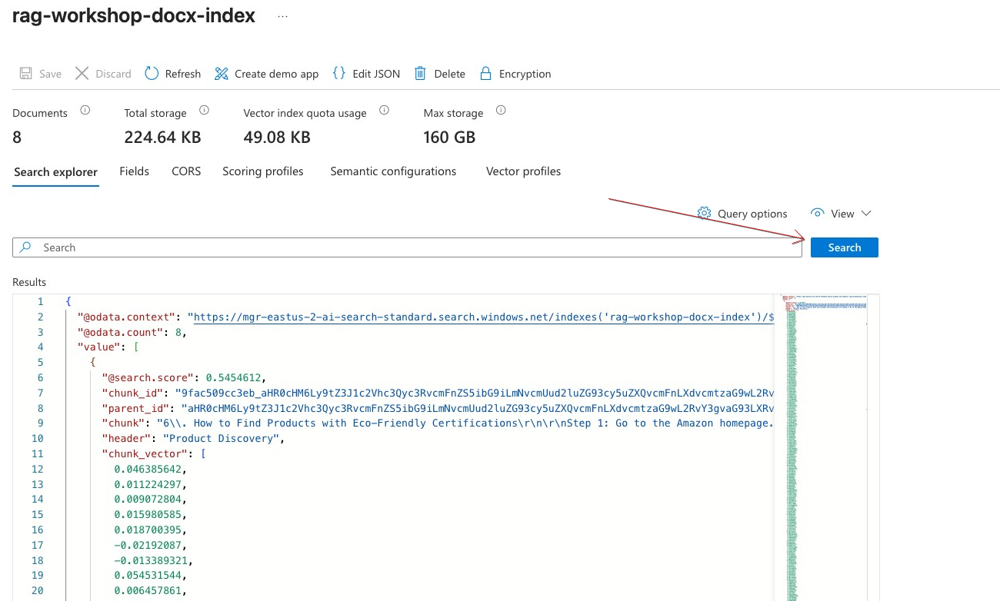 

If you got the results, meaning your data was successfully extracted from Azure Storage Account DOCX files, it was properly chunked and vectorized using skillset and ingested into an index using indexer.

## Recap

In this section you've learned how to ingest textual documents into Azure AI Search using ingestion pipeline. You learned about pipeline components such as Data Source, Skillset and Indexer and successfully ingested two DOCX files using advanced chunking and vectorization.

You will about querying your data in the [Lab3 - Advanced Retrieval](./lab3_retrieval.md).
But first you are going to apply what you've learned and ingest data in CSV format. Proceed to [Lab2 - Ingesting CSV Data](./lab2_csv_ingestion.md).