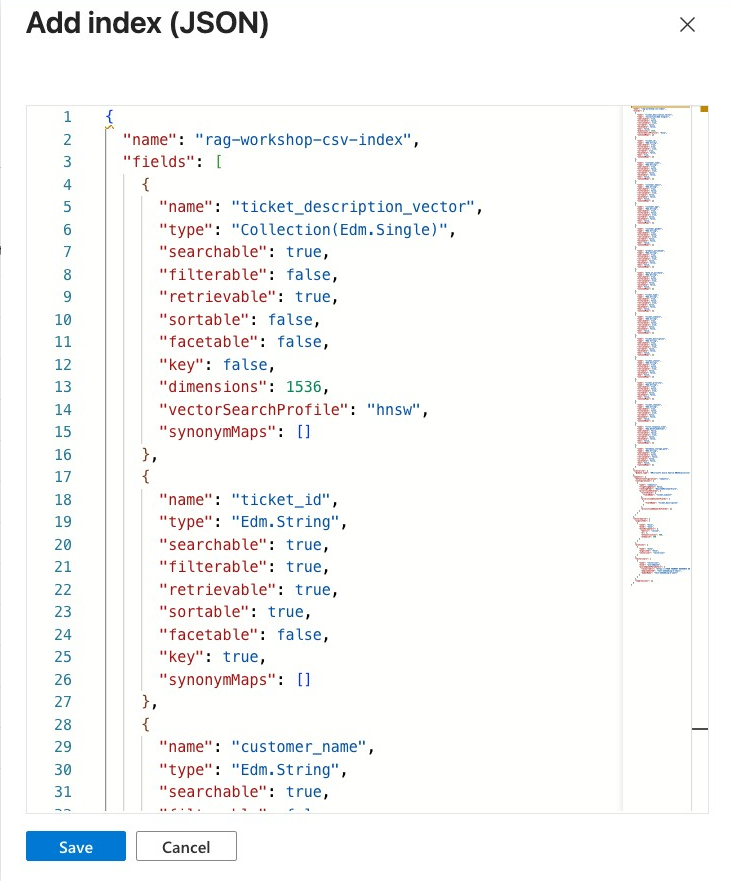
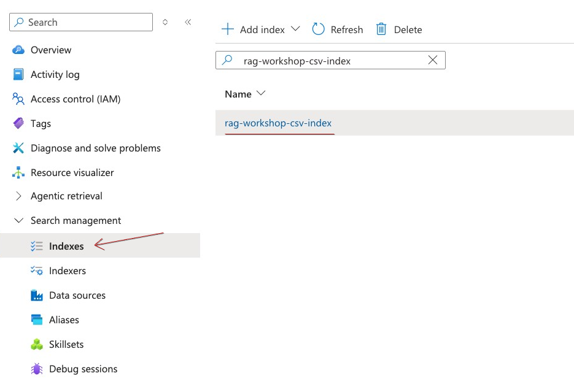
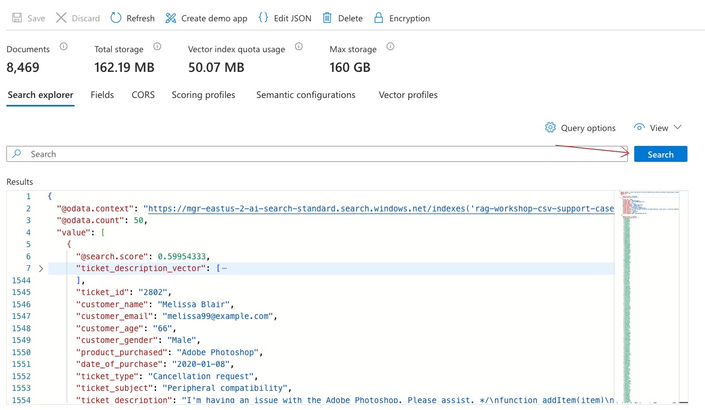

# Ingest and vectorize CSV data into Azure AI Search using Indexer and Skillsets

In this section you are going to use the same building blocks from [Lab1](./lab1_text_ingestion.md) to ingest CSV data into AI Search index.

## Explore CSV Data

Open `datasets/csv/customer_support_tickets_part1.csv`.
The file contains sample data of technical support tickets. By ingesting this data into Azure AI Search you can implement *Find similar cases* functionality. You will be able to search for an issue and see if there are cases in the system that solves the issue you encounter. 

CSV also great as it gives you plenty of additional metadata that can be used to apply filters. For example you can run searches against `ticket_subject` and `ticket_description` fields look for similar ticket that was resolved in a past and then explore what was the resolution from the `resolution` field. To narrow down the search you can filter the data with `ticket_status=Closed` to search only resolved tickets. 
Filters are great way to improve accuracy and performance of your searches.

When ingesting CSV files your target index schema should correspond the source CSV schema to allow you greater flexibility on filtering metadata.
You will use `ticket_description` to create embedding vector and the rest of the fields will be indexed as is.

## Upload your files into Azure Storage

1. In the Azure Portal, go to your Storage account -> Data Storage -> Containers. Click on **rag-workshop** container that you've previously created.

 

2. Click **Add Directory**, call it `csv`, click **Ok**.

3. Click Upload, then select `customer_support_tickets_part1.csv`   from the `datasets/csv` folder. Keep the destination path as `csv/` so the files are organized under that prefix, and click **Upload**.

4. Once the upload completes, verify that the files appear in the container under the `csv/` path and that each document is listed as a blob, confirming they are ready to be used as a data source for downstream indexing.

Your Storage Account now should look like this
```
{storage account name}/
└── rag-workshop/
    └── csv/
        └── customer_support_tickets_part1.csv
```

## Create Index

1. Go to Azure AI Search service. In the left menu, go to Search management → Indexes and select + Add index (or Create index).  

2. Copy the full contents of `src/lab2/index.json` from the repository, then paste it into the editor. Review the index name and schema to ensure they match your expected query patterns and required fields. !
 

3. Scroll down to the bottom of index configuration till you see `vectorizers` section. Change the `resourceUri` field to correspond previously create Microsoft Foundry endpoint. 

4. Click **Save**

### Review index details

- In the left navigation bar go to Search Management -> Indexes. Ensure `rag-workshop-csv-index` has been created. 

- Click on the index name then click on `Fields` to explore index schema. Note that index schema corresponds the CSV file schema + `metadata_storage_path` for tracking back the original file path on Azure Storage. Some CSV fields such as `customer_email` and `customer_gender` were ommited as they are not relevant to our use case.

- Note `ticket_description_vector` field of type `SingleCollection` with `Dimension` configuration of `1536`. This field will be populated with embedding vectors generated with `text-embedding-3-small` model. 

Now that you have your second index proceed to creating an ingestion pipeline components.

## Create Data Source

1. Go to Search Management -> Data sources. Click on Add Data Source.  

2. Give your data source a name `rag-workshop-csv-datasource`, then select your Storage Account, `rag-workshop` as Blob Container and `csv` as a folder. Keep defaults for other fields and click `Create`.

## Create Skillset

In this lab the skillset configuration will be minimal as you only need to apply vectorization on `ticket_description` field without any additional enrichment or chunking. 
Because in CSV files you want to ingest every single CSV row as a separate document, so no chunk split or layout detection is required.

Explore `src/lab2/skillset.json`. Note the `inputs` section:

```json
"inputs": [
    {
        "name": "text",
        "source": "/document/ticket_description",
        "inputs": []
    }
]
```
This is where you choose `ticket_description` to be used for creating vectors.

**Proceed to creating skillset:**

1. Go to Search Management -> Skillsets. Click `add skillset`.
2. Copy the full contents of `src/lab2/skillset.json` from the repository, then paste it into the editor.
3. Change `resourceUri` field with your Foundry endpoint.
4. Change `apiKey` field with your Foundry api key.
5. Click **Save**.

## Create Indexer

Go to Search Management -> Indexers. Click `add indexer`.

**Basic Settings:**

- Name = `rag-workshop-csv-indexer`.
- Index = `rag-workshop-csv-index`.
- Datasource = `rag-workshop-csv-datasource`.
- Skillset = `rag-workshop-csv-skillset`.
- Schedule = `Once`.

**Advanced Settings:**

- Data to extract = `Content and Metadata`.
- Parsing mode = `Delimeted Text`.
- First line contains header = `Checked`.
- Allow Skillset to read file data = `Checked`.
- Skip other fields, scroll up and click **Save**.

## Run ingestion

Go to Search Management -> Indexers. Click on your `rag-workshop-docx-indexer`.

Click `Run` button and wait few seconds.

Click on `Refresh` and see if the run was successful.

Check `Docs succeeded` section on the right part of a page. It should be 10.

Congratulations! You successfully ingested your first 10 documents from CSV file. Before exploring the data in the index you will going to try an incremental data loading with indexer.

## Incremental indexing

Try to `Run` indexer again...
The run should be successful, but the `Docs succeeded` field will indicate that 0 documents were ingested. That is actually good - indexer keeps track of the files already ingested. This feature will prevent you from creating data duplicates. 

Let's upload second CSV file into Azure Storage Account and Run indexer again.

1. Go to your Storage account -> Data Storage -> Containers -> **rag-workshop** -> `csv` folder.
2. Upload `datasets/csv/customer_support_tickets_part2.csv`
3. Go to AI Search -> Search Management -> Indexers. Click on your `rag-workshop-docx-indexer`.
4. Click on `Run`. Wait for a minute as the uploaded csv file contains 1000 rows.
5. Click on `Refresh` and check `Docs succeeded` section to indicate 1000 documents were ingested.

You successfully ran indexer incrementally loading new data into target index.
In production often you will have ETL pipelines extracting data from diverse data sources and operational systems and loading them into Azure Storage Account acting as main integration point or a data lake. Then Indexer, configured to run periodically, will pick only new data, enable transformations using skillsets and ingest data into target index. This is how you automate ingestion process across multiple file formats.

## Explore the data

Go to Search Management -> Indexes. Click on `rag-workshop-csv-index`.

Click on `Search` button to run a query against the index.

 

If you got the results, meaning your data was successfully finished Lab2!

## Recap

In this lab you've learned how to ingest CSV data into Azure AI Search using ingestion pipeline. You also tested the incremental loading feature.
Now you're ready for running advanced queries on your indexes.

Proceed to [Lab3 - Advanced Retrieval](./lab3_retrieval.md).

