# Lab3 - Search and Retrieval with Search Explorer

In this lab you are going to run queries. You will be running free text queries also known as keyword queries, vector queries, hybrid queries, applying filters and semantic ranking. You will learn how to read AI Search query results and understand the differences between different query types and when to use what.

## About query types
Before diving into the searches let's review different query types supported in Azure AI Search.

- **Keyword** (or free-text) query - AI Search acts as textual search engine. It matches user query to keywords in the index using it's internal algorithms.

- **Vector Search** - AI Search acting as Vector Database and enables so-called ANN (approximate nearest neighbours) search to find what vectors are mathematically closer to the vector submitted by a user. Few things must happen to make it work:
  - Textual information in the database must be translated to vectors and saved on the index - that is exactly what you did in the Lab1 and Lab2. 
  - User query also need to be translated to vector to allow vector-to-vectors search. User query in-transit translation is made possible index `Vector Profile` that is configured on the index itself. `Vector profile` connected to embedding model deployed in Microsoft Foundry.
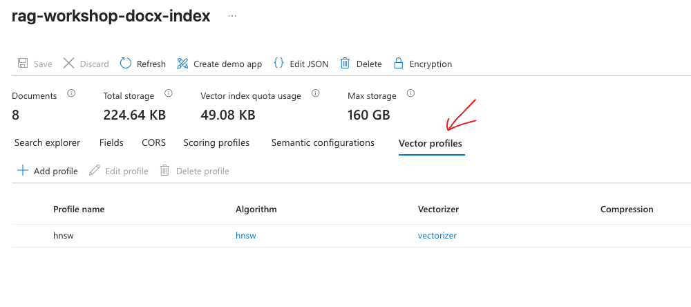
You can review `src/lab1/index.json` entire `vectorSearch` section of the json configuration.

- **Hybrid Search** - is a mix of keyword search + vector search. AI Search runs both searches and then combines the results form both queries to achieve maximum accuracy. Often you achieve best accuracy by using this option.

To learn more about each of these types visit AI Search [documentation](https://learn.microsoft.com/en-us/azure/search/search-query-overview).

## Mastering Search explorer

Search Explorer is a great tool to run and test queries before you connect AI Search to any application or AI agent.

Go to Azure AI Search -> Search Mangement -> Indexes -> `rag-workshop-docx-index` to open a Search explorer.

Click on **Search** and review the results...

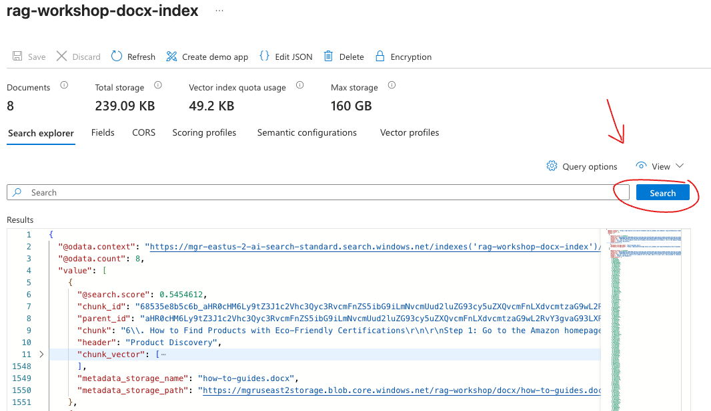 

Congrats! You just ran your first Hybrid search query 🤓.

This is because hybrid search is activated automatically on any index includes vectors when working with Search Explorer.

### Explore Search explorer settings

Click on **Query options**. 

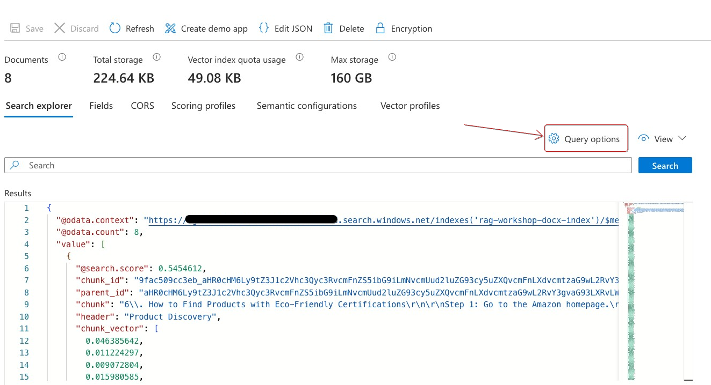 

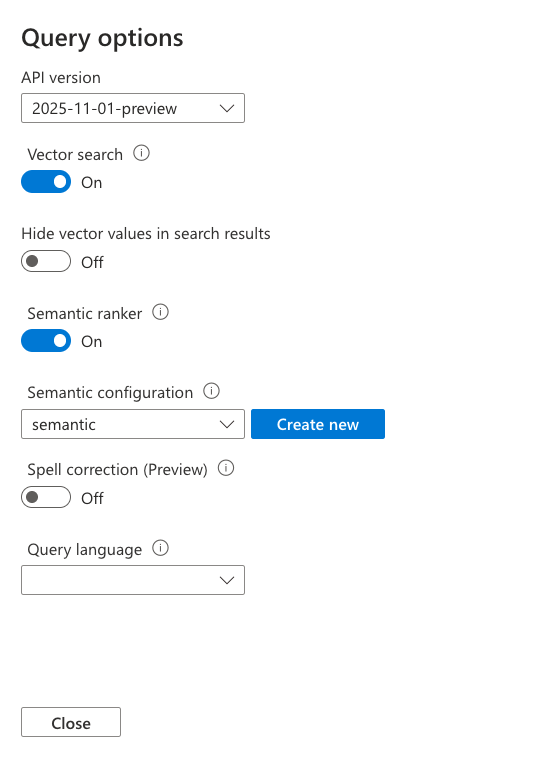 

**Vector search is ON** - meaning every Search in the Search explorer will run vector query. This is done alongside the keyword query making it Hybrid Search query.

**Semantic Ranker is ON** - this configuration let you refine the results even further. You will learn about Semantic Ranking and it's affect later in this lab.

**Disable** both Vector Search and Semantic Ranker and click **Close**.

Open **Fields** tab and uncheck the `Retrievable` attribute on the `chunk_vector` field as we are not interested in seeing vectors in results right now. Click **Save**.

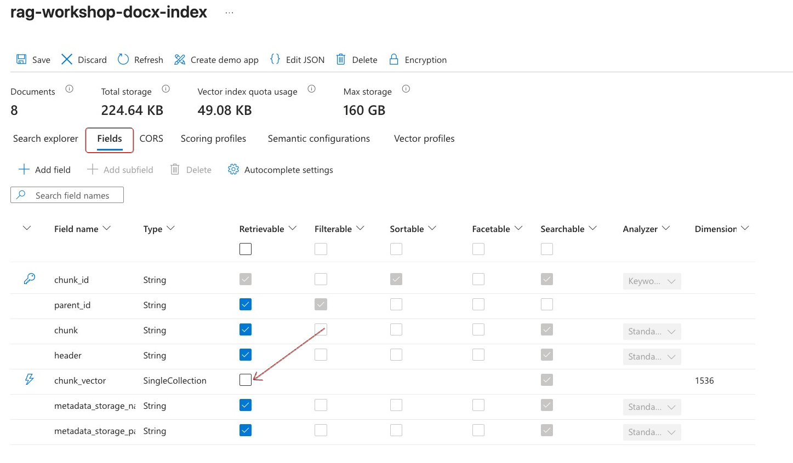 

Go back to **Search explorer** and click **Search**. 

> If you encounter 
`InvalidVectorQuery: The 'text' property of the 'text' vector query can't be null or empty` error just **disable** Vector Search and Semantic Ranker in the **Query options** again.

## Keyword search

Let's start with some simple query. Open Search explorer on `rag-workshop-csv-index` index. In a Search bar type the following query and click on Search.

```
I am having an issue with the Dyson Vacuum Cleaner
```

Now review the results:

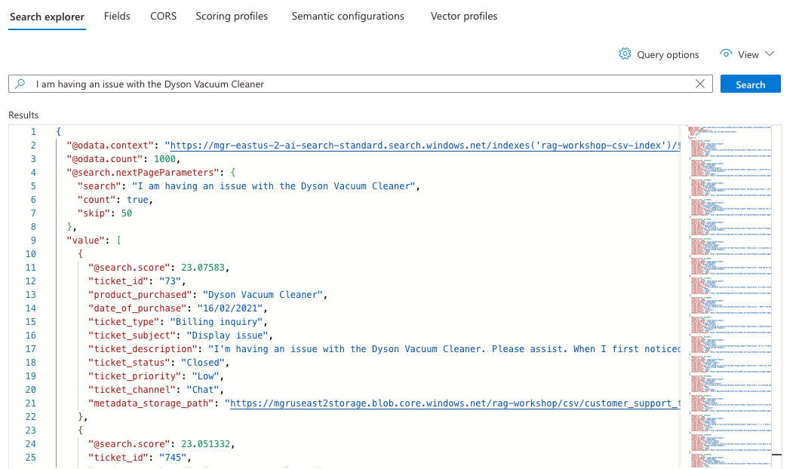 

By default search explorer will show the first 50 results.
If you scroll down you will notice plenty of tickets found related to your query. Note that each document has `@search.score` and all documents sorted by this `@search.score` in a descending order. This is the default behaiviour - AI Search constructed the results based on relevance of documents in a descending order from the most relevant to least ones. To learn more on how `@search.score` is determined visit [this page](https://learn.microsoft.com/en-us/azure/search/search-relevance-overview).

You can also see some additional useful metadata returned as part of each document such as `ticket_id`, `ticket_type`, `ticket_subject`, `ticket_status` as well as `metadata_storage_path` that indicated the source file location in the Azure Storage tha this document originates from.

If you review `ticket_type` field across the returned documents you'll notice that results include many types of tickets: *Billing inquiry, Refund request, Cancellation request, Product inquiry, Technical issue* and more.
Same goes for `ticket_status`, results contain Open and Closed tickets. What if you need your query to return only resolved Technical issues tickets? This is where filters come into play.

### Using Filters

Click on View -> JSON view

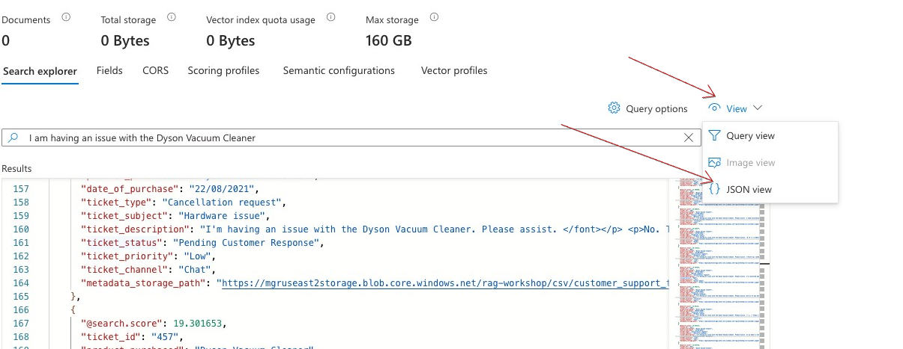 

Now you see the actual query construct behind the search explorer. **JSON view** supports filters, orderby, select, count, searchFields, and other parameters.

Use the previous query, but this time adding filter.

```json
{
  "search": "I am having an issue with the Dyson Vacuum Cleaner",
  "count": true,
  "filter": "ticket_type eq 'Technical issue' and ticket_status eq 'Closed'"
}
```

Note the filter syntax `ticket_type eq 'Technical issue'` is equivalent to `ticket_type = 'Technical issue'`. Azure AI Search is based on Apache Lucene - an open-source standard for search engines. To learn more about AI Search query syntax visit [documentation](https://learn.microsoft.com/en-us/azure/search/query-simple-syntax).

Click **Search** and review the results.

```json
{
  "@odata.context": "https://service-cluster-endpoint.search.windows.net/indexes('rag-workshop-csv-index')/$metadata#docs(*)",
  "@odata.count": 76,
  "@search.nextPageParameters": {
    "search": "I am having an issue with the Dyson Vacuum Cleaner",
    "count": true,
    "filter": "ticket_type eq 'Technical issue' and ticket_status eq 'Closed'",
    "skip": 50
  },
  "value": [
    {
      "@search.score": 19.06229,
      "ticket_id": "109",
      "product_purchased": "Dyson Vacuum Cleaner",
      "date_of_purchase": "08/01/2020",
      "ticket_type": "Technical issue",
      "ticket_subject": "Product setup",
      "ticket_description": "I'm having an issue with the Dyson Vacuum Cleaner. Please assist. \" }, \" https://api.blockchain.info/api/v1/v1.0 \" } ;\nHere, we can fetch a blockchain I've noticed a sudden decrease in battery life on my Dyson Vacuum Cleaner. It used to last much longer.",
      "ticket_status": "Closed",
      "ticket_priority": "Critical",
      "ticket_channel": "Chat",
      "metadata_storage_path": "https://azureblobstorageaccount.blob.core.windows.net/rag-workshop/csv/customer_support_tickets_part2.csv"
    },
    {
      "@search.score": 6.564067,
      "ticket_id": "251",
      "product_purchased": "Roomba Robot Vacuum",
      "date_of_purchase": "27/07/2021",
      "ticket_type": "Technical issue",
      "ticket_subject": "Product setup",
      "ticket_description": "I'm having an issue with the Roomba Robot Vacuum. Please assist. I'm experiencing this issue on multiple devices of the same model, so it seems to be a widespread problem.",
      "ticket_status": "Closed",
      "ticket_priority": "Critical",
      "ticket_channel": "Phone",
      "metadata_storage_path": "https://azureblobstorageaccount.blob.core.windows.net/rag-workshop/csv/customer_support_tickets_part2.csv"
    },
    {
      "@search.score": 5.537905,
      "ticket_id": "590",
      "product_purchased": "PlayStation",
      "date_of_purchase": "23/02/2020",
      "ticket_type": "Technical issue",
      "ticket_subject": "Data loss",
      "ticket_description": "I'm having an issue with the PlayStation. Please assist.\nI am not working with an actual company or company-funded research program, nor my own research and my own experience with the products or services. I've performed a factory reset on my PlayStation, hoping it would resolve the problem, but it didn't help.",
      "ticket_status": "Closed",
      "ticket_priority": "High",
      "ticket_channel": "Phone",
      "metadata_storage_path": "https://azureblobstorageaccount.blob.core.windows.net/rag-workshop/csv/customer_support_tickets_part2.csv"
    },
    {
      "@search.score": 5.511339,
      "ticket_id": "484",
      "product_purchased": "Amazon Kindle",
      "date_of_purchase": "24/09/2020",
      "ticket_type": "Technical issue",
      "ticket_subject": "Product setup",
      "ticket_description": "My Amazon Kindle is making strange noises and not functioning properly. I suspect there might be a hardware issue. Can you please help me with this?\nSorry for the inconvenience, I am now using my iMac Pro. I'm worried that the issue might be hardware-related and might require repair or replacement.",
      "ticket_status": "Closed",
      "ticket_priority": "Low",
      "ticket_channel": "Phone",
      "metadata_storage_path": "https://azureblobstorageaccount.blob.core.windows.net/rag-workshop/csv/customer_support_tickets_part2.csv"
    },

```

1. `@odata.count": 76` - AI Search found total of 76 results corresponds to your search query out of **1010** documents in the index. Data scanned reduced drammatically when using filters.

2. All the results filtered to Technical issue with status = Closed.

3. Only first document actually refers to *Dyson Vacuum Cleaner*, other results seem unrelevant to what you searched. You can also see how `@search.score` dropped from being `19` on first result to `6` and below to others. Without going too deep into this worth mentioning that this is how Search Engines work - they deconstruct the input query and calculate relevance of each word compared to the corpus of data using [inverted index](https://en.wikipedia.org/wiki/Inverted_index). You have a way to limit results and boost score, but this is out of scope of this Lab.

Now that you've learned how to query your AI Search indexes with keyword search it is time to do some advanced type of queries. 

## Vector Query

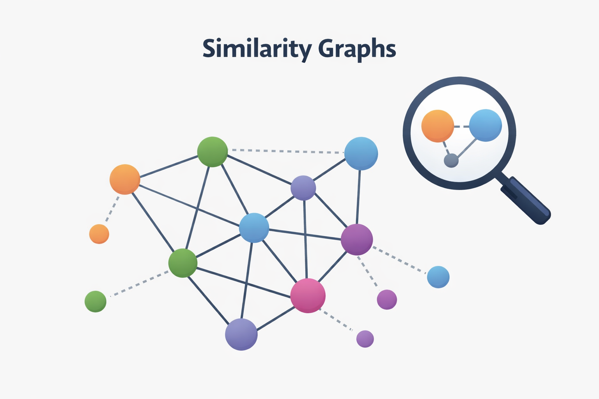

Vector similarity measures how close two items are after they’re converted into numeric vectors (embeddings). `[0.046385642,0.011224297,0.009072804]`.

During ingestion phase in [Lab1](./lab1_text_ingestion.md) you've endoded DOCX files content into embeddings and stored them in `chunk_vector` field in `rag-workshop-docx-index`. The vectorization is done by using `text-embedding-3-small` embedding model deployed in Microsoft Foundry.

In order to run a vector search query user need to provide his question translated to vector. Azure AI Search can automate this with integrated vectorization feature.


When user submits query the flow executes in the following order:

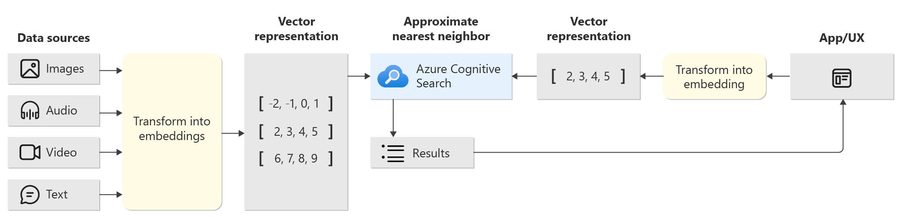 

1. User submits textual query
2. AI Search sends textual query into `text-embedding-3-small`
3. `text-embedding-3-small` respond with vector embedding.
4. Azure AI Search run similarity search between in input vector and vectors stored in the `rag-workshop-docx-index`.


### Run vector query
Go to Search Management -> Indexes -> `rag-workshop-docx-index` -> Vector profiles tab.

 

There you can see the integrated vectorization configured. The configuration is done on the Index level. During or after index creation. To learn more about Vector profile visit [AI Search docs](https://learn.microsoft.com/en-us/azure/search/vector-search-how-to-configure-vectorizer).

Switch to Search explorer -> View -> JSON View
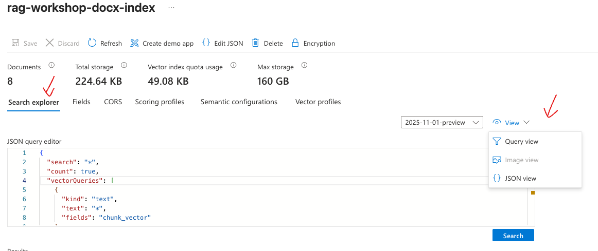 

Replace the contents of **JSON query editor** with the following JSON and click on **Search** button.
```json
{
  "count": true,
  "vectorQueries": [
    {
      "kind": "text",
      "text": "How can I change my mailing address?",
      "fields": "chunk_vector",
      "k": 3
    }
  ]
}
```

Let's breakdown:
1. You executed vector search query.
2. The question `How can I change my mailing address?` was translated to vector on the fly, then AI Search executed and similarity search against vectors stored in `chunk_vector` field.
3. `k` is the number of nearest neighbor matches to include in results.

You can also apply filters to narrow down the vectors space on which AI search will run the similarity search by using `filter` combined with `vectorFilterMode` parameters. Take into consideration that filtering may have performance affect.

```json
{
  "count": true,
  "filter": "metadata_storage_name eq 'how-to-guides.docx'",
  "vectorFilterMode": "preFilter",
  "vectorQueries": [
    {
      "kind": "text",
      "text": "How can I change my mailing address?",
      "fields": "chunk_vector",
      "k": 3
    }
  ]
}
```

For advanced topics such as running multi-vector queries, setting weights and thresholds visit [documentation](https://learn.microsoft.com/en-us/azure/search/vector-search-how-to-query).

## Hybrid Query

Hybrid query is a combination of both keyword search and vector search to [achieve better accuracy in results](https://techcommunity.microsoft.com/blog/azure-ai-foundry-blog/azure-ai-search-outperforming-vector-search-with-hybrid-retrieval-and-reranking/3929167). Behind the scenes AI Search actually runs two parallel queries, then it merged and reorders the results and returns a unified result set. 

Add `"search": "How can I change my mailing address?"` to your previous search to execute Hybrid query and let's review the results.

```json
{
  "search": "How can I change my mailing address?",
  "count": true,
  "vectorQueries": [
    {
      "kind": "text",
      "text": "How can I change my mailing address?",
      "fields": "chunk_vector",
      "k": 3
    }
  ]
}
```

First to notice is that the results contain 8 documents and not 3 as in vector query. This is because `k` parameter has no effect on the keyword search part of a hybrid query. If you want to limit the keyword results use `top` parameter.

`@search.score` is on a different scale when comparing results between vector and hybrid queries. You cannot compare scores between two different query types, because score is relative to the specific query and calculated dynamically, however notice the significant score drop between 3rd and 4th documents in a hybrid query. This is because the first 3 documents found by vector search (k=3) and the rest were picked by free-text.
- Vector scores: 0.62679213, 0.6107838, 0.6007314
- Hybrid scores: 0.03306011110544205, 0.032522473484277725, `0.0320020467042923, 0.01666666753590107`, 0.015625, 0.015384615398943424, 0.01515151560306549, 0.014925372786819935.

To learn more about hybrid search visit [documentation](https://learn.microsoft.com/en-us/azure/search/hybrid-search-how-to-query?tabs=portal).

## Using Semantic ranking

Now that you understand differences between keyword search, vector search and hybrid search let's review another capability that improves retrieval relevance - Semanic renking.

Semantic ranker operates on top of other search types. 
Take the previous hybrid query against `rag-workshop-docx-index` and keep the page open to compare the results against another query with semantic ranking enabled.

```json
{
  "search": "How can I change my mailing address?",
  "count": true,
  "vectorQueries": [
    {
      "kind": "text",
      "text": "How can I change my mailing address?",
      "fields": "chunk_vector",
      "k": 3
    }
  ]
}
```

Now in another tab ran the same query but with Semantic ranking enabled:

```json
{
  "search": "How can I change my mailing address?",
  "count": true,
  "vectorQueries": [
    {
      "kind": "text",
      "text": "How can I change my mailing address?",
      "fields": "chunk_vector",
      "k": 3
    }
  ],
  "queryType": "semantic",
  "semanticConfiguration": "semantic"
}
```

Note two parameters added to the query to enable Semantic Ranking:
- `"queryType": "semantic"`
- `"semanticConfiguration": "semantic"`

### Secondary ranking

Note that semantic ranking added new field to the results: `@search.rerankerScore`. The results are sorted based on this new field.
Semantic ranker adds secondary ranking to reorder results in a way that can better answer original user query.
If you compare the results you will see that the document with highest `@search.score` in hybrid query moved to third place in a query with Semantic ranker enabled. Other documents position also changed. Rule #1 - once semantic ranking enabled the results are resorted based on `@search.rerankerScore` and this is the field you should consider for relevance and not the original `@search.score`.

Table below shows how document position affected by semantic ranking.

| Chunk ID (short) | Hybrid Query Position | Semantic Ranking Position | Δ (Promotion by Semantic) |
|-----------------|-----------------------|----------------------------|---------------------------|
| 11cfb3d186…doc_0 | 2 | 1 | ↑1 |
| 11cfb3d186…doc_2 | 3 | 2 | ↑1 |
| 11cfb3d186…doc_0 | 1 | 3 | ↓2 |
| 11cfb3d186…doc_2 | 6 | 4 | ↑2 |
| 11cfb3d186…doc_3 | 8 | 5 | ↑3 |
| 11cfb3d186…doc_1 | 4 | 6 | ↓2 |
| 11cfb3d186…doc_3 | 5 | 7 | ↓2 |
| 11cfb3d186…doc_1 | 7 | 8 | ↓1 |

### Enable query rewrite 

Query rewrite or query augmentation - let's you dynamically rewrite user query by generating multiple variations of the same query to try to improve retrieval relevance.

Add `"queryRewrites":"generative|count-3"` to the previous query and explore the results.

```json
{
  "search": "How can I change my mailing address?",
  "count": true,
  "vectorQueries": [
    {
      "kind": "text",
      "text": "How can I change my mailing address?",
      "fields": "chunk_vector",
      "k": 3
    }
  ],
  "queryType": "semantic",
  "semanticConfiguration": "semantic",
  "queryRewrites":"generative|count-3",
  "queryLanguage": "en-us",
  "debug":"queryRewrites"
}
```

Review the `@search.debug` block of the results:

```json
"@search.debug": {
  "semantic": null,
  "queryRewrites": {
    "text": {
      "inputQuery": "How can I change my mailing address?",
      "rewrites": [
        "steps to update mailing address",
        "steps to update my mailing address",
        "steps to update mailing address online"
      ]
    },
    "vectors": [
      {
        "inputQuery": "",
        "rewrites": []
      }
    ]
  }
}
```

Semantic ranking created three variations of the input query. AI Search executed all of them alongside your original query. Then multiple scoring mechanisms kicked in to calculate relevance of the results.

Query rewrite supports dozens of languages and can help you with localization if you have data in multiple languages in the index but the search query is in english. Learn more about query rewrites [here](https://learn.microsoft.com/en-us/azure/search/semantic-how-to-query-rewrite).

You can also include `"queryRewrites":"generative|count-3"` into `vectorQueries` of your request to generate additional vector queries.

> Keep in mind that Semantic ranking is both resource and time intensive.
> 
> Using Semantic Ranker billed separatelly and may incur additional charges. See [Azure AI Search pricing](https://azure.microsoft.com/en-us/pricing/details/search/).


## Recap

In this lab you've learned about different query types you probably ask yourself which type should I use? 

Based on the [benchmark](https://techcommunity.microsoft.com/blog/azure-ai-foundry-blog/azure-ai-search-outperforming-vector-search-with-hybrid-retrieval-and-reranking/3929167) executed by Microsoft team Hybrid Query with Semantic reranker provides the **best accuracy**. 

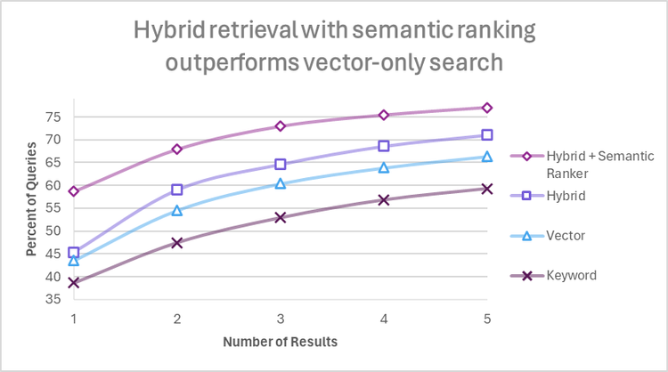

We recommend to run your own tests and see what works best for you data in terms of accuracy versus speed of retrieval.

For indexes configured with Vectorizer and Semantic Reranker the Search explorer in the AI Search UI uses **Hybrid + Semantic Reranker** mode by default.