# Lab 4 - Building Support RAG Agent in Microsoft Foundry

In this lab you will learn how to create AI agents grounded to your corporate data using Azure AI Search and Microsoft Foundry Agent Service.

Microsoft Foundry Agent Service augments development of retrieval logic of your RAG agent. RAG stands for [retrieval augmented generation](https://learn.microsoft.com/en-us/azure/search/retrieval-augmented-generation-overview?tabs=videos). Foundry agent will run searches against connected Azure AI Search upon user prompt. It handles the entire end-to-end flow of retrieving the data from the indexes and summarizing it before responding to a user based on the agent instructions.

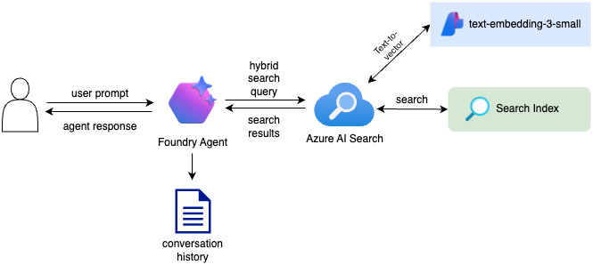 


## About Microsoft Foundry Agents

Foundry Agent Service help you create, deploy and run AI agents in production.
Foundry Agent Service connects core pieces of Foundry (such as models, tools, and frameworks) into a single runtime. 

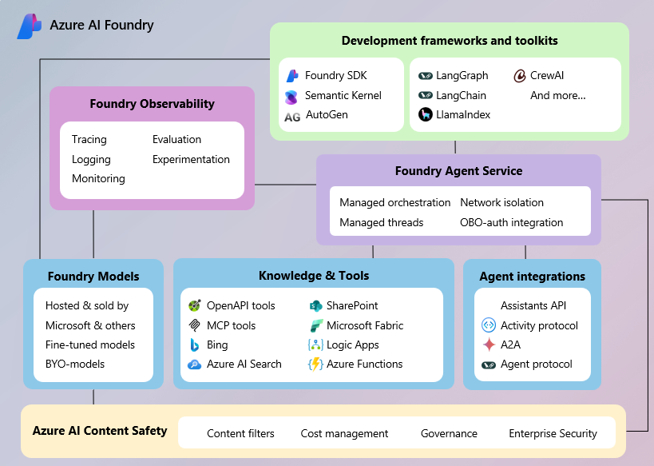 

It manages conversations, orchestrates tool calls, enforces content safety, and integrates with identity, networking, and observability systems. These activities help ensure that agents are secure, scalable, and production ready. 

To learn more about Foundry Agent Service visit [documentation](https://learn.microsoft.com/en-us/azure/ai-foundry/agents/overview?view=foundry).

## Connect Azure AI Search to Microsoft Foundry

> Ensure you have followed the [Prerequisites](./README.md#prerequisites) section and you have active Microsoft Foundry resource and two base LLM models deployed: gpt-4.1 and gpt-4.1-mini. If not please do it now.

### Create your first Foundry Agent

1. Navigate to https://ai.azure.com
2. Go to Build -> Agents -> **Create agent**

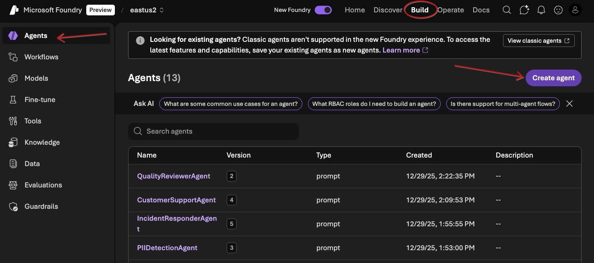 

3. Name your agent ***RagWorkshopSupportAgent*** and click **Create**
4. Choose gpt-4.1 model
5. Paste the following in the instructions

```text
You are a Customer Support Agent. Your role is to provide accurate, concise, and helpful answers to customer questions.

Goal: Resolve user issues efficiently by delivering clear, actionable responses grounded in verified information.

Knowledge usage: Before responding, always query Azure AI Search to retrieve the most relevant information from the knowledge base. Base your answer strictly on retrieved results; if information is missing or unclear, state the limitation and ask a clarifying question.
```

6. Expand Knowledge section, click **Add** -> **Set up a data source via tools**.

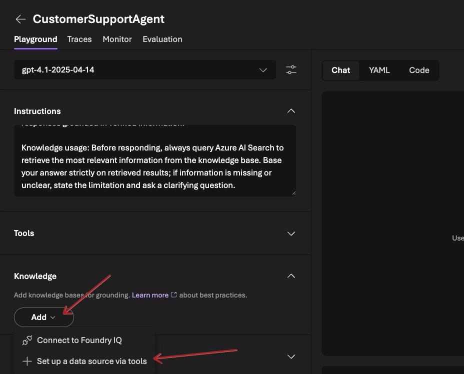 

7. In the Select a tool popup choose Azure AI Search -> click **Add tool**.

8. In the Azure AI Search connection dropdown choose your Azure AI Search cluster.

9. Now choose **rag-workshop-docx-index** and click **Add**.

10.  Click on three dots on the AI Search tool -> **Parameters**

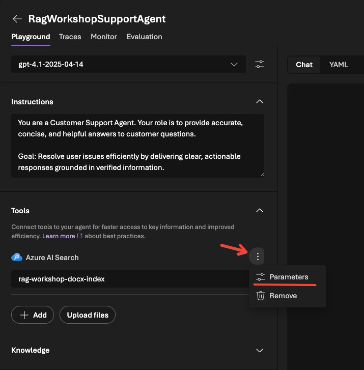   


11. Choose **Hybrid + Semantic** as your Search type. Reduce Retrieved documents to 1.

12. Click **Save**

Congrats! You successfully created your first RAG AI Agent in Microsoft Foundry.
You've connected AI agent to existing index in the Azure AI Search and instructed it to rely on data from the AI Search instead of his own knowledge - this called grounding. Now it is time to test it.

### Test your agent

In agent playground ask the following question.

```text
How can I cancel an Amazon order if it’s already been shipped?
```

Now explore the results.

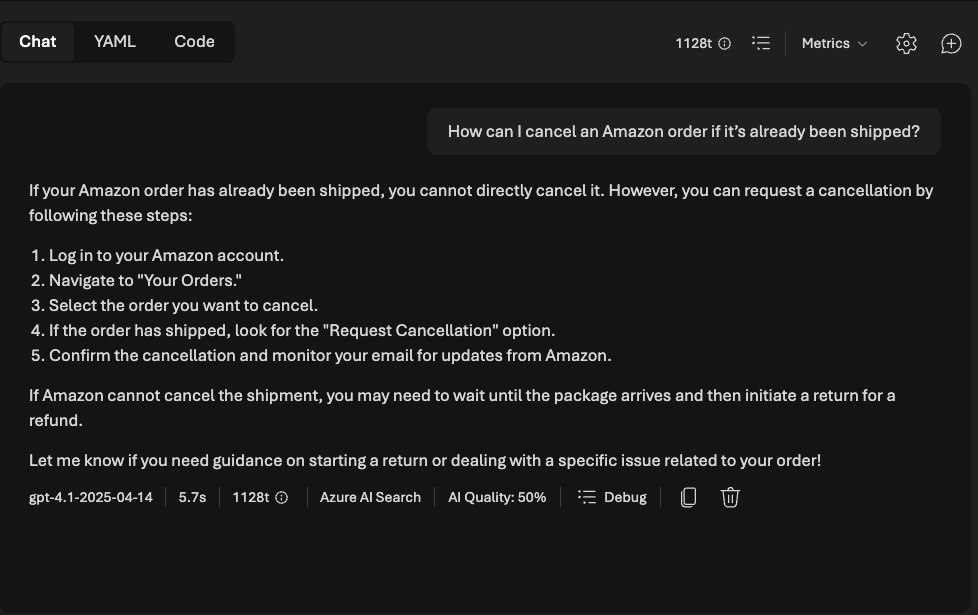 

Notice that the agent response actually grounded to the `datasets/docx/how-to-guides.docx`.

---
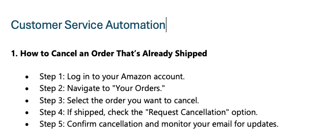
---

This means that the entire flow worked perfectly. Agent passed user prompt into AI Search, retrieved single document back and responded to a user based on the information from the AI Search index.

### Debug agent response

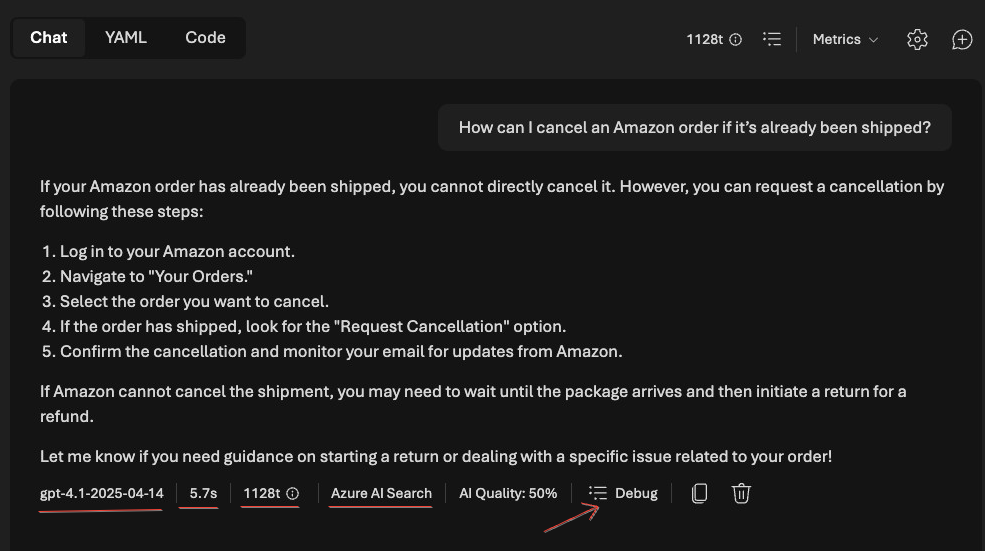 

Along with the agent response you also get some useful information:

- What model responded to a user prompt - `gpt-4.1-2025-04-14`.
- How long it took agent to generate response - `5.7s`.
- How many tokens were used to generate the response - `1128t`.
- What tools were called - `Azure AI Search`.
- Click **Debug** to see the response trace.

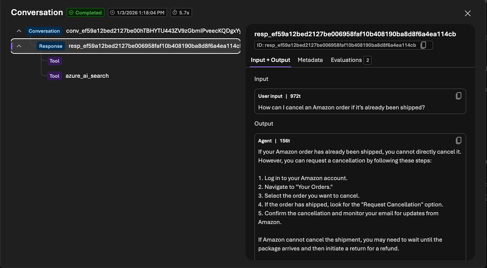 

In the debug screen you can dig deeper into the agent call details, explore which tools were called and review the response metadata to see the raw API response and check things like breakdown into `prompt_tokens` and `completion_tokens`.

```json
"usage_info": {
    "prompt_tokens": 972,
    "completion_tokens": 156,
    "total_tokens": 1128
}
```

## Publish Agent

Now that your agent is ready you can publish it and integrate into your corporate application. Use it to automate some business workflow or connect to the business applications such as Microsoft Teams and Microsoft 365 Copilot.

1. Go to Build -> Agents -> **RagWorkshopSupportAgent**
2. Click on Publish -> **Publish agent** 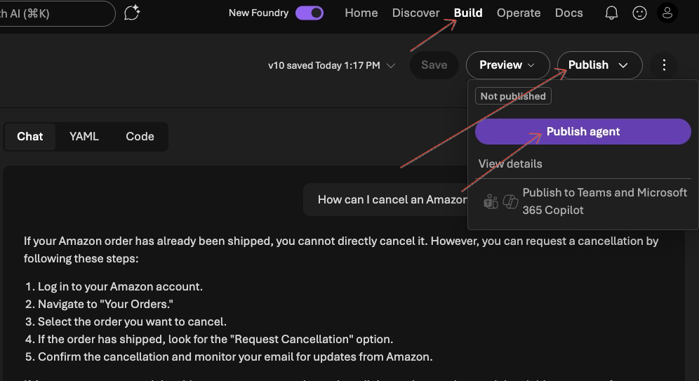

3. In the Publish popup click on **Publish** and wait few moments...


Excellent! Now your agent is published. Publishing promotes an agent from a development asset into a managed Azure resource with a dedicated endpoint, independent identity, and governance capabilities. You now have multiple ways on how to consume this agent programmatically.

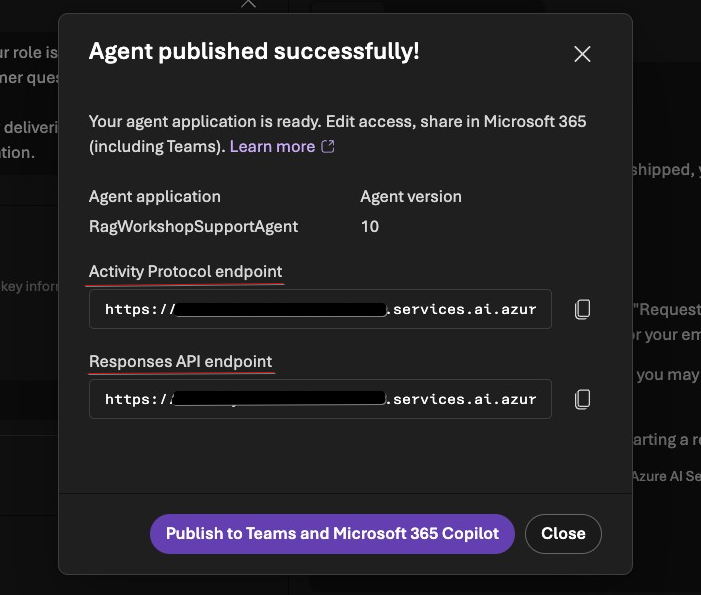 

Responses endpoint allows you to use standard responses api protocol to interract with the agent.

Close the popup and click on `Code` tab. Here you can see how to call your agent using python.

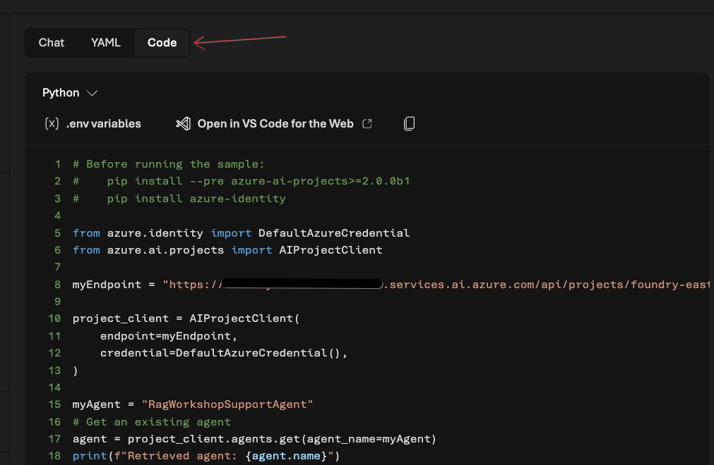

To learn more about publishing agents visit [this page](https://learn.microsoft.com/en-us/azure/ai-foundry/agents/how-to/publish-agent?view=foundry).


## Recap

In this lab you learned how to ground AI agent to your corporate data in Microsoft Foundry.
You've created AI agent and connected it to the Azure AI Search index. You also learned how to configure Hybrid + Semantic search type that AI agent will execute on retrieval phase. Then you've learned how to debug the results and ensure proper tool was called during the execution using Traces. Finally you've published your agent made it ready for production use.


